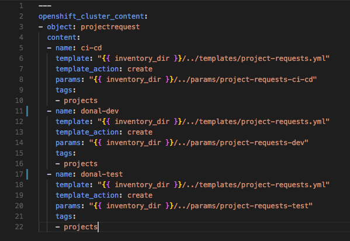
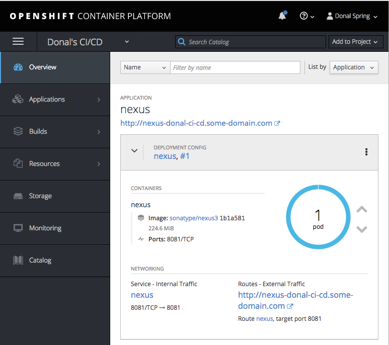

# The Manual Menace

> In this lab learners will use Ansible to drive automated provisioning of Projects, Access Control, Git, Jenkins and Nexus

_____

## Learning Outcomes
As a learner you will be able to

1. Run the OpenShift Applier to automate creating cluster content
1. Create and admin project namespaces in OpenShift
1. Deploy commonly used applications to support the development process

## Tools and Frameworks

* [GitLab](https://about.gitlab.com/) - Community driven Git server now with integrated DevOps Toolchain.
* [Nexus](https://www.sonatype.com/nexus-repository-sonatype) - Repository manager for storing lots of application types. Can also host `npm` and `Docker` registries.
* [Jenkins](https://jenkins.io/) - OpenSource Build automation server. Highly customisable with plugins.
* [Ansible](https://www.ansible.com/) - IT Automation tool used to provision and manage state of cloud and physical infrastructure.
* [OpenShift Applier](https://github.com/redhat-cop/openshift-applier) - Community driven Git server

## Big Picture
This exercise begins with an empty Cluster
> TODO - add big picture here...

_____

## 10,000 Ft View
> This lab is aimed at the creation of the tooling that will be used to support the rest of the Exercises. The highlevel goal is to create a collection of project namespaces and populate them with Git, Jenkins & Nexus.

If you're feeling confident and don't want to follow the step-by-step guide these highlevel instructions should provide a challenge for you:

2. Clone the repo `git@github.com:rht-labs/enablement-ci-cd.git` which contains the scaffold of the project.

2. Create `<your-name>-ci-cd`, `<your-name>-dev` and `<your-name>-test` project namespaces using the inventory and run them with the OpenShift Applier to populate the cluster

2. Use the templates provided to create build and deployment configs in `<your-name>-ci-cd` for. Templates are on a branch called `exercise1/git-nexus` && `exercise1/jenkins`:
    * Nexus
    * GitLab
    * Jenkins (using an s2i to pre-configure jenkins)

2. Commit your `enablement-ci-cd` repository to the GitLab Instance you've created

2. Burn it all down and re-apply your inventory proving config-as-code works. 

## Step by Step Instructions
> This is a structured guide with references to exact filenames and explanations.

### Part 1 - Create OpenShift Projects
3. Clone the scaffold project to your local machine and open it in your favourite editor.
```bash
git clone git@github.com:rht-labs/enablement-ci-cd.git
```

3. The project is laid out as follows
```
.
├── README.md
├── docker
│   └── jenkins-slave-node
├── inventory
│   ├── group_vars
│   │   └── all.yml
│   └── hosts
├── jenkins-s2i
│   ├── configuration
├── params
│   └── project-requests-ci-cd
├── requirements.yml
└── templates
        └── project-requests.yml
```
 * `docker` folder contains our jenkins-slave images that will be used by the builds.
 * `jenkins-s2i` contains the configuration and plugins we want to bring jenkins to life with
 * `params` houses the variables we will load the templates with
 * `templates` is a collection of OpenShift templates
 * `inventory/group_vars/all.yml` is the collection of objects we want to insert into the cluster.
 * `requirements.yml` is a manifest which contains the ansible modules needed to run the playbook
Open the `inventory/group_vars/all.yml` file; you should see a some variables setup to create the `ci-cd` namespace. This calls the `templates/project-requests.yml` template with the `params/project-requests-ci-cd` parameters. We will add some additional content here but first let's explore the parameters and the template

3. Open the `params/project-requests-ci-cd` and replace the `<YOUR_NAME or initials>` with your name to create the correstponding projects in the cluster. 


3. Create another two params files for `params/project-requests-dev` & `params/project-requests-test` and add the `NAMESPACE=<YOUR_NAME>-dev` && `NAMESPACE=<YOUR_NAME>-test` and update their Display names.

3. In the `inventory/group_vars/all.yml` file; add the new inventory items for the projects you want to create (dev & test) by adding another object to the content array. You can copy and paste them from the `ci-cd` example and update them accordingly eg
```yaml
  - name: <YOUR_NAME>-dev
    template: "{{ inventory_dir }}/../templates/project-requests.yml"
    template_action: create
    params: "{{ inventory_dir }}/../params/project-requests-dev"
    tags:
    - projects
  - name: <YOUR_NAME>-test
    template: "{{ inventory_dir }}/../templates/project-requests.yml"
    template_action: create
    params: "{{ inventory_dir }}/../params/project-requests-test"
    tags:
    - projects
```


3. With the configuration in place; install the OpenShift Applier dependency
```bash
$ ansible-galaxy install -r requirements.yml --roles-path=roles
```

3. Apply the inventory by logging into OpenShift and then running 
```bash
$ oc login -p <password> -u <user> <cluster_url>
$ ansible-playbook roles/openshift-applier/playbooks/openshift-cluster-seed.yml -i inventory/
``` 

3. Once successful you should see an output similar to this 

### Part 2 - Nexus and GitLab
> _Now that we have our Projects setup; we can start to populate them with Apps to be used in our dev lifecycle_

4. In the `enablement-ci-cd` repo, checkout the templates for Nexus by running
```bash
$ git checkout exercise1/git-nexus templates/nexus.yml
```
The tempate contains all the things needed to setup a persistent nexus server, exposing a service and route while also creating the persistent volume needed. Have a read through the template; at the bottom you'll see a collection of parameters we will pass to the template.

4. Add some parameters for running the template by creating a new file in the `params` directory. 
```bash
$ touch params/nexus
```

4. The essential params to inclue in this file are: `params` directory. 
```bash
VOLUME_CAPACITY=5Gi
MEMORY_LIMIT=2Gi
```

4. Create a new object in the inventory variables called `ci-cd-tools` and populate it's `content` is as follows (swapping `<YOUR_NAME>-ci-cd` for the namespace you created earlier)

```yaml
- object: ci-cd-tools
  content:
  - name: "nexus"
    namespace: "<YOUR_NAME>-ci-cd"
    template: "{{ inventory_dir }}/../templates/nexus.yml"
    params: "{{ inventory_dir }}/../params/nexus"
    tags:
    - nexus
```


4. Run the OpenShift applier, specifying the tag `nexus` to speed up it's execution.
```bash
$ ansible-playbook roles/openshift-applier/playbooks/openshift-cluster-seed.yml \
     -i inventory/ \
     -e="filter_tags=nexus"
```

4. Once successful; login to the cluster and navigate to the `<YOUR_NAME>-ci-cd`. You should see Nexus up and running. You can login with default credentials (admin / admin123) 

4. Now lets do the same thing for GitLab to get it up and running. Checkout the template provided by running
```bash
$ git checkout exercise1/gitlab-nexus templates/gitlab.yml
``` 
Explore the template; it contains the PVC, buildConfig and services. The DeploymentConfig is made up of these apps
 - Redis (3.2.3)
 - PostgreSQL (9.4)
 - GitLab CE (v10.2.3)

4. Add a new params file in the `params` folder called `gitlab`
```bash
$ touch params/gitlab
```

4. Open the `params/gitlab` file and add the following params
```
LDAP_BIND_DN=uid=<BIND_USER>,ou=People,dc=<YOUR_DOMAIN>,dc=com
LDAP_USER_FILTER=(memberof=CN=YourGroup,OU=Users,DC=<YOUR_DOMAIN>,DC=com)
LDAP_PASSWORD=<BIND_USER_PASSWORD>
LDAP_HOST=<LDAP_HOST>
LDAP_BASE=ou=People,dc=<YOUR_DOMAIN>,dc=com
LDAP_LABEL="<LDAP_DESCRIPTION>"
GITLAB_ROOT_PASSWORD=<GITLAB_ROOT_USER_PASSWORD>
GITLAB_DATA_VOL_SIZE=2Gi
POSTGRESQL_VOL_SIZE=1Gi
APPLICATION_HOSTNAME=<GITLAB_URL>
NAMESPACE=<YOUR_NAME>-ci-cd
```
where the following need to be replaced by actual values:
    * `<BIND_USER>` is the user used to query the LDAP
    * `<BIND_USER_PASSWORD>` is the password used when querying the LDAP
    * `<YOUR_DOMAIN>` is the domain the LDAP is hosted on
    * `<LDAP_HOST>` is fqdn of the LDAP server
    * `<LDAP_DESCRIPTION>` is the description to be used on the sign-in header for GitLab eg "Name LDAP Login"
    * `<GITLAB_ROOT_USER_PASSWORD>` is the root user for GOD access on the GitLab instance eg password123
    * `<GITLAB_URL>` is the endpoint for gitlab. It will take the form `gitlab-<YOUR_NAME>-ci-cd.apps.<ENV_ID>.<YOUR_DOMAIN>.com`

4. Create another object in the inventory `all_vars.yml` file to run the build & deploy of this template. Add the following and update the `namespace:` accordingly
```yaml
  - name: "gitlab"
    namespace: "<YOUR_NAME>-ci-cd"
    template: "{{ inventory_dir }}/../templates/gitlab.yml"
    params: "{{ inventory_dir }}/../params/gitlab"
    tags:
    - gitlab
```

4. Run the OpenShift applier, specifying the tag `gitlab` to speed up it's execution.
```bash
$ ansible-playbook roles/openshift-applier/playbooks/openshift-cluster-seed.yml \
     -i inventory/ \
     -e="filter_tags=gitlab"
```

4. Once successful; login to the cluster and navigate to the `<YOUR_NAME>-ci-cd`. You should see GitLab up and running. 

4. Navigate to gitlab. You can login with using your cluster credentials using the LDAP tab displaying your `<LDAP_DESCRIPTION>` from previous steps


### Part 3 - Jenkins & s2i
5. Add new plugin ...

### Part 4 - live, die repeat
6. Commit your code to the new repo in GitLab

6. Burn your OCP content to the ground 

6. Re-apply the inventory!

_____

## Extension Tasks
> Ideas for go-getters. Advanced topic for doers to get on with if they finish early. These will usually not have a solution and are provided for additional scope.

 - Add more secure access for Nexus (ie not admin / admin123) using the automation to drive secret creation

_____

## Additional Reading
 > List of links or other reading that might be of use / reference for the exercise
