# Attack of the Pipelines

> In this exercise we will explore the sample TODO List application and create a pipeline in Jenkins to build and deploy our code.


## Exercise Intro
This lesson is focused on creating a pipeline for our application. What is a pipeline? A pipeline is a series of steps or stages that takes our code from source to a deployed application. There can be many stages to a pipeline but a simple flow is to run a `build > bake > deploy`. Usually the first stage is triggered by something like a git commit. There could be many steps in each of these stages; such as compiling code, running tests and linting. All of these are done to try and drive up code quality and give more assurance that what is deployed is behaving as expected. In the exercise we will create Jenkins pipeline by configuring it through the UI, this will create an un-gated pathway to production

First we will explore the sample application and get it running locally. The sample app is a `todolist` app - the `Hello World` app of the modern day.

#### Why create pipelines
* Assurance - drive up code quality and remove the need for dedicated deployment / release management teams
* Freedom - allow developers to take ownership of how and when code gets built and shipped
* Reliability - pipelines are a bit boring; they execute the same way each and every time they're run!
* A pathway to production:
    - Puts the product in the hands of the customer quicker
    - Enables seamless and repeatable deploys
    - More prod like infrastructure increases assurance
    - “We have already done it” behavior de-risks go live

_____

## Learning Outcomes
As a learner by the end of this lesson you will be able to

- Build and run the full stack of the TODO List application locally
- Create an un-gated pipeline using the Jenkins UI for the backend and frontend
- Add branching to the pipeline to target specific namespace

## Tools and Frameworks
> The following tools are used throughout this exercise. Familiarity with them is not required but knowing what they are may help. You will not need to install Vue or Mongodb they are taken care of by our `todolist` app.

1. [Jenkins](https://jenkins.io/) - OpenSource build automation server; highly customisable through plugins
1. [NodeJS](https://nodejs.org/en/) - Node.js® is a JavaScript runtime built on Chrome's V8 JavaScript engine. Node.js uses an event-driven, non-blocking I/O model that makes it lightweight and efficient. Node.js' package ecosystem, npm, is the largest ecosystem of open source libraries in the world.
1. [MongoDB](https://www.mongodb.com/what-is-mongodb) - MongoDB stores data in flexible, JSON-like documents, meaning fields can vary from document to document and data structure can be changed over time
1. [VueJS](https://vuejs.org/) - Vue (pronounced /vjuː/, like view) is a progressive framework for building user interfaces. It is designed from the ground up to be incrementally adoptable, and can easily scale between a library and a framework depending on different use cases. It consists of an approachable core library that focuses on the view layer only, and an ecosystem of supporting libraries that helps you tackle complexity in large Single-Page Applications.

## Big Picture
> From the previous exercise; we created some supporting tooling needed by our app/

_____

## 10,000 Ft View
> _This lab requires users to take the sample TODO app and create a build pipeline in Jenkins by clicking your way to success ending up with an app deployed to each of the namespaces created previously_

2. Import the projects into your gitlab instance. See the README of each for build instructions

2. Deploy a `MongoDB` using the provided template to all project namespace.

2. Create 2 pipelines with three stages (`build`, `bake`, `deploy`) in Jenkins for `develop` & `master` branches on the `todolist-fe` such that:
    * a `Build` job is responsible for compiling and packaging our code:
        1. Checkout from source code (`develop` for `<yourname>-dev` & `master` for `<yourname>-test`)
        2. Install node dependencies and run a build / package
        3. Send the package to Nexus
        4. Archive the workspace to persist the workspace in case of failure
        4. Tag the GitLab repository with the `${JOB_NAME}.${BUILD_NUMBER}` from Jenkins. This is our `${BUILD_TAG}` which will be used on downstream jobs.
        5. Trigger the `bake` job with the `${BUILD_TAG}` param
    * a `Bake` job should take the package and put it in a Linux Container
        1. Take an input of the previous jobs `${BUILD_TAG}` ie `${JOB_NAME}.${BUILD_NUMBER}`.
        2. Checkout the binary from Nexus and unzip its contents
        3. Run an oc start-build of the App's BuildConfig and tag its imagestream with the provided `${BUILD_TAG}`
        4. Trigger a deploy job using the parameter `${BUILD_TAG}`
    * a `deploy` job should roll out the changes by updating the image tag in the DC:
        1. Take an input of the `${BUILD_TAG}`
        2. Patch / set the DeploymentConfig to the image's `${BUILD_TAG}`
        3. Rollout the changes
        4. Verify the deployment

2. Repeat the above setup for the backend `todolist-fe`. TIP - use the copy config to speed things up!

2. Verify that both apps and the DB are talking to one another as expected.

## Step by Step Instructions
> This is a fairly structured guide with references to exact filenames and sections of text to be added.

### Part 1 - Explore the Todo List App
> _In this part of the exercise we will explore the sample application, become familiar with it locally before building and deploying in OCP Land_

#### 1a Todolist-fe

2. Git clone the `todolist-fe` project to somewhere sensible and checkout the `develop` branch using the following.
```bash
cd ~/innovation-labs
```
```bash
git clone https://github.com/rht-labs/todolist-fe.git
```
```bash
cd todolist-fe
```
```bash
./git-pull-all.sh
```
```bash
git checkout develop
```

2. Open up Gitlab and login. Create a new project (internal) in GitLab called `todolist-fe` to host your clone of the project and copy its remote address. 

2. In your local clone of the `todolist-fe`, remove the origin and add the GitLab origin by replacing `<YOUR_GIT_LAB_PROJECT>`. Push your app to GitLab
```bash
git remote set-url origin <YOUR_GIT_LAB_PROJECT>
# verify the origin has been updated
git remote -v
git push -u origin --all
```

2. To get the app running locally; first check you've got node and npm installed
```bash
node -v
npm -v
```
<p class="tip" >
NOTE - If you are missing these dependencies; install them with ease using the [Node Version Manager](https://github.com/creationix/nvm)
</p>


2. The `todolist-fe` has a package.json at the root of the project, this defines some configuration for the app including its dependencies, dev dependencies, scripts and other configuration. Install the app's dependencies
```bash
npm install
```

2. The `todolist-fe` has some scripts defined in the package.json at the root of the project. A snippet of the npm scripts are shown below. To run any of these scripts run `npm run <SCRIPT_NAME>`. Let's start by serving our application
 
```bash
npm run serve
```

2. This will take sometime to execute; but once done it should open the browser for you displaying the homepage of the `todolist-fe` app.
 
    * Click 'Todo' at the top of the home page to get to the above page.
    * The server hosting it live reloads; so if you make changes to your code base the app will live update
    * The Data you see in the screen is dummy / stubbed data. This is served up when there is no backend connection found

2. The app is a todolist manager built in Vue.js. Play around with the App. You will notice when you add todos they appear and clear as expected. If you refresh the page you'll lose all additions. This is because there is no persistence layer. We will add one in the next part.

3. The structure of the `todolist-fe` is as follows.
```bash
todolist-fe
├── jest.config.js
├── jsconfig.json
├── nightwatch.config.js
├── node_modules
├── package.json
├── public
│   ├── favicon.ico
│   ├── img
│   ├── index.html
│   └── manifest.json
├── src
│   ├── App.vue
│   ├── assets
│   ├── components
│   │   └── *
│   ├── config
│   ├── main.js
│   ├── registerServiceWorker.js
│   ├── router.js
│   ├── scss
│   ├── services
│   ├── store
│   │   └── *
│   └── views
│       └── *
├── tests
│   ├── e2e
│   └── unit
└── vue.config.js
```
where the following are the important things:
    * `./src` is the main collection of files needed by the app. The entrypoint is the `main.js` which is used to load the root `App.vue` file.
    * `./node_modules` is where the dependencies are stored
    * `./test` contains our end-to-end tests and unit tests. More covered on these in later exercises.
    * `./src/components` contains small, lightweight reusable components for our app. For example, the `NewTodo` component which encapsulates the styling, logic and data for adding a new todo to our list
    * `./src/store` is the `vuex` files for managing application state and backend connectivity
    * `./src/views` is the view containers; which are responsible for loading components and managing their interactions.
    * the `./src/router.js` controls routing logic. In our case the app only has one real endpoint.
    * `./src/scss` contains custom SCSS used in the application.
    * `./*.js` is mostly config files for running and managing the app and the tests

2. To prepare Nexus to host the binaries created by the frontend and backend builds we need to run a prepare-nexus script. Before we do this we need to export some variables and change `<YOUR_NAME>` accordingly in the below commands.
```bash
export NEXUS_SERVICE_HOST=$(oc get route nexus --template='{{.spec.host}}' -n <YOUR_NAME>-ci-cd)
```
```bash
export NEXUS_SERVICE_PORT=80
```
```bash
npm run prepare-nexus
```
<p class="tip">
NOTE - This step in a residency would be automated by a more complex nexus deployment in the ci-cd project
</p>

#### 1b Todolist-api

2. Now let's move on to the `todolist-api` and wire them together. As with the `todolist-fe` we need to clone the repo and add it to our GitLab in the cluster.
```bash
cd ~/innovation-labs
```
```bash
git clone https://github.com/rht-labs/todolist-api.git
```
```bash
cd todolist-api
```
```bash
./git-pull-all.sh
```
```bash
git checkout develop
```

2. On GitLab; create a new project (internal) called `todolist-api` to host your clone of the project and copy its remote address as you did for the previous repositories.

2. In your local clone of the `todolist-api`, remove the origin and add the GitLab origin by replacing `<YOUR_GIT_LAB_PROJECT>`. Push your app to GitLab
```bash
git remote set-url origin <YOUR_GIT_LAB_PROJECT>
```
```bash
git push -u origin --all
```

2. Once pushed; explore the application. It is a NodeJS application with the Express.js framework and MongoDB for persistent storage. Same as before, the `package.json` defines most of the configuration etc. Install the dependencies
```bash
npm i
```

2. While the dependencies are being installed; explore the project structure.
```bash
todolist-api
├── Dockerfile
├── Gruntfile.js
├── README.md
├── node_modules
├── package-lock.json
├── package.json
├── server
│   ├── api
│   │   └── todo
│   ├── app.js
│   ├── components
│   │   └── errors
│   ├── config
│   │   ├── environment
│   │   ├── express.js
│   │   ├── local.env.sample.js
│   │   └── seed.js
│   ├── mocks
│   │   ├── mock-routes-config.json
│   │   ├── mock-routes.js
│   │   └── mock-routes.spec.js
│   ├── routes.js
│   └── views
│       └── 404.html
└── tasks
    └── perf-test.js
```
where the following are the important things:
    * `./server` is the main collection of files needed by the app. The entrypoint is the `app.js`
    * `./node_modules` is where the dependencies are stored
    * `./server/api` is where the api's controller, data model & unit test are stored.
    * `./server/mocks` is a mock server used for when there is no DB access    
    * `./server/config` stores our Express JS config, header information and other middleware.
    * `./server/config/environment` stores environment specific config; such as connectivity to backend services like MongoDB.
    * `./tasks` is a collection of additional `Grunt` tasks which will be used in later exercises
    * `Grunt` is a taskrunner for use with Node.JS projects
    * `package.json` contains the dependency list and a lot of very helpful scripts for managing the app lifecycle

2. A snippet of the npm scripts are shown below. There are application start scripts, build and test items which will be used in the build. The ones for MongoDB are just provided for convenience and require Docker installed to execute.
```json
  "scripts": {
    "start": "node server/app.js",
    "dev": "./node_modules/.bin/grunt serve",
    "jshint": "./node_modules/.bin/grunt jshint",
    "clean": "rm -rf reports package-contents*",
    "package": "zip -r package-contents.zip package-contents",
    "test": "node_modules/.bin/nyc node_modules/.bin/mocha server/**/*.spec.js --exit",
    "mongo" : "docker run -i -d --name mongo-local -p 27017:27017 mongo",
    "mongo:drop" : "npm run mongo:stop && docker rm mongo-local",
    "mongo:stop" : "docker stop mongo-local",
    "mongo:start" : "docker start mongo-local"
  },
```

2. To run the application; start a new instance of MongoDB by running the following. This will pull a mongodb image from Dockerhub and then start it for our API to connect to.
```bash
npm run mongo
```
<p class="tip">
NOTE - `npm run mongo:drop` is used to completely remove the running container. `npm run mongo:stop` & `npm run mongo:start` will preserve data in the container
</p>

2. Fire up the `todolist-api` by running.
```bash
npm run start
```


2. Check things are up and running by testing the API with a `curl`. The API should return some seeded data (stored in `server/config/seed.js`)
```bash
curl localhost:9000/api/todos
```
```json
[{
    "_id": "5ac8ff1fdfafb02138698948",
    "title": "Learn some stuff about MongoDB",
    "completed": false,
    "__v": 0
  },
  {
    "_id": "5ac8ff1fdfafb02138698949",
    "title": "Play with NodeJS",
    "completed": true,
    "__v": 0
}]
```

2. Now let's check out `todolist-fe` app by reloading the browser. We should now see our dummy front end data is replaced by the backend seed data. Adding new todos will add them in the backend, these will persist when the page is refreshed.
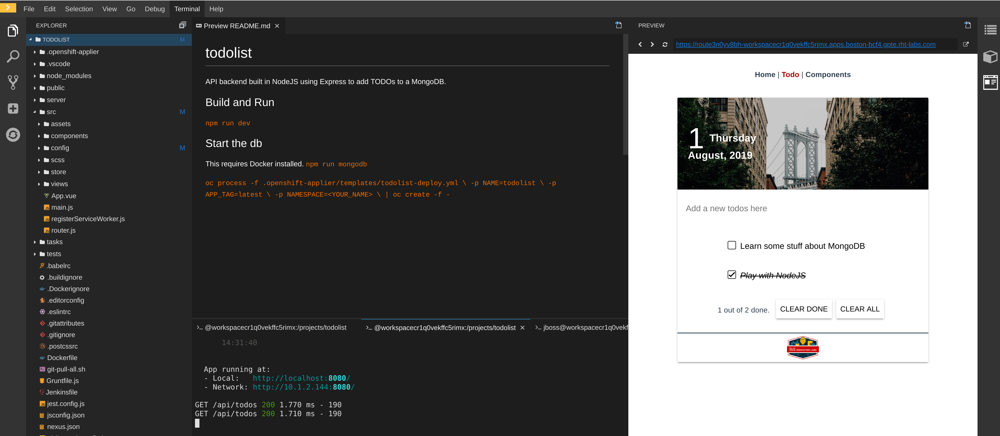

### Part 2 - Add configs to cluster
> _In this exercise; we will use the OpenShift Applier to drive the creation of cluster content required by the app such as MongoDB and the Apps Build / Deploy Config_

4. On your terminal navigate to the root of the `todolist-fe` application. The app contains a hidden folder called `.openshift-applier`. Move into this `.openshift-applier` directory and you should see a familiar looking directory structure for an Ansible playbook.
```
.openshift-applier
├── README.md
├── apply.yml
├── inventory
│   ├── group_vars
│   │   └── all.yml
│   └── hosts
├── params
│   ├── build
│   ├── dev
│   ├── ocp-pipeline
│   └── test
├── requirements.yml
└── templates
    ├── ocp-pipeline.yml
    ├── todolist-fe-build.yml
    └── todolist-fe-deploy.yml
```
with the following
    * the `apply.yml` file is the entrypoint.
    * the `inventory` contains the objects to populate the cluster with.
    * the `params` contains the variables we'll apply to the `templates`
    * the `templates` required by the app. These include the Build, Deploy configs as well as the services, health checks, and other app definitions.

4. There are a few updates to these manifests we need to make before applying the cluster content. In the `apply.yml` update the namespace `<YOUR_NAME>` variables accordingly.
```yaml
    ci_cd_namespace: donal-ci-cd
    dev_namespace: donal-dev
    test_namespace: donal-test
```

4. In the `params` folder update the `dev` and `test` files with the correct `<YOUR_NAME>` as you've done above. Example for the `dev` file:
```bash
PIPELINES_NAMESPACE=donal-ci-cd
NAME=todolist-fe
DEPLOYER_USER=jenkins
APP_TAG=latest
NAMESPACE=donal-dev
```

4. With those changes in place we can now run the playbook. First install the `openshift-applier` dependency and then run the playbook (from the `.openshift-applier` directory). This will populate the cluster with all the config needed for the front end app.
```bash
ansible-galaxy install -r requirements.yml --roles-path=roles
```
```bash
ansible-playbook apply.yml -i inventory/
```


4. Once successful, `commit` and `push` your changes to gitlab.
```bash
git add .
```
```bash
git commit -m "UPDATE - change namespace vars to donal"
```
```bash
git push
```

4. Back on your terminal navigate to the root of the `todolist-api` application. Open the `.openshift-applier` directory in your editor. The same layout as seen in `todolist-fe` should be visible with one noticeable difference; the api requires `MongoDB` to connect to at runtime.

4. In the `apply.yml` update the namespace `<YOUR_NAME>` variables accordingly. For example:
```yaml
    ci_cd_namespace: donal-ci-cd
    dev_namespace: donal-dev
    test_namespace: donal-test
```

4. In the `params` folder update the `dev` and `test` files with the correct `<YOUR_NAME>` as you've done above. Example for the `dev` file:
```bash
PIPELINES_NAMESPACE=donal-ci-cd
NAME=todolist-api
DEPLOYER_USER=jenkins
APP_TAG=latest
NAMESPACE=donal-dev
```

4. Finally; run the Openshift Applier and install its dependencies to run the content into the cluster
```bash
ansible-galaxy install -r requirements.yml --roles-path=roles
```
```bash
ansible-playbook apply.yml -i inventory/
```

4. Once successful, `commit` and `push` your changes to gitlab.
```bash
git add .
```
```bash
git commit -m "UPDATE - change namespace vars to donal"
```
```bash
git push
```

4. Validate the build and deploy configs have been created in Openshift by checking `<YOUR_NAME> CI-CD builds` for the `BuildConfigs`


4. Check `<YOUR_NAME>-dev` to see the deployment configs are in place


### Part 3 - Build > Bake > Deploy
> _In this exercise; we take what we have working locally and get it working in OpenShift_

This exercise will involve creating three stages (or items) in our pipeline, each of these is detailed below at a very high level. Move on to the next step to begin implementation.
* a *build* job is responsible for compiling and packaging our code:
    1. Checkout from source code (`develop` for `<yourname>-dev` & `master` for `<yourname>-test`)
    2. Install node dependencies and run a build / package
    3. Send the package to Nexus
    4. Archive the workspace to persist the workspace in case of failure
    4. Tag the GitLab repository with the `${JOB_NAME}.${BUILD_NUMBER}` from Jenkins. This is our `${BUILD_TAG}` which will be used on downstream jobs.
    5. Trigger the `bake` job with the `${BUILD_TAG}` param
* a *bake* job should take the package and put it in a Linux Container
    1. Take an input of the previous jobs `${BUILD_TAG}` ie `${JOB_NAME}.${BUILD_NUMBER}`.
    2. Checkout the binary from Nexus and unzip its contents
    3. Run an oc start-build of the App's BuildConfig and tag its imagestream with the provided `${BUILD_TAG}`
    4. Trigger a deploy job using the parameter `${BUILD_TAG}`
* a *deploy* job should roll out the changes by updating the image tag in the DC:
    1. Take an input of the `${BUILD_TAG}`
    2. Patch / set the DeploymentConfig to the image's `${BUILD_TAG}`
    3. Rollout the changes
    4. Verify the deployment
* We will now go through these steps in detail.

#### 3a - Build

5. With the BuildConfig and DeployConfig in place for both our apps (`*-fe` & `*-api`) from previous steps; Log into Jenkins and create a `New Item`. This is just jenkins speak for a new job configuration. 

5. Name this job `dev-todolist-fe-build` and select `Freestyle Project`. All our jobs will take the form of `<ENV>-<APP_NAME>-<JOB_PURPOSE>`. 

5. The page that loads is the Job Configuration page and it can be returned to at anytime from Jenkins. Let's start configuring our job. To conserve space; we will make sure Jenkins only keeps the last build's artifacts. Tick the `Discard old builds` checkbox, then `Advanced` and set `Max # of builds to keep with artifacts` to 1 as indicated below
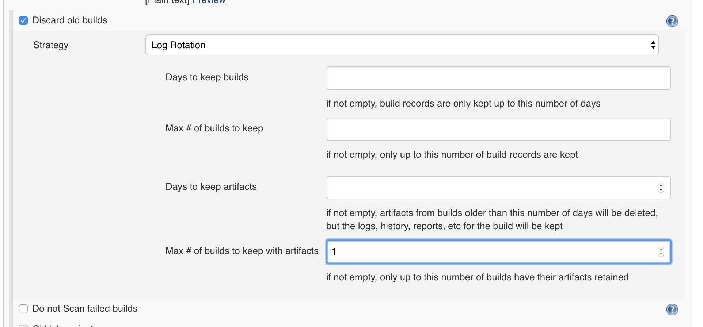

5. Our NodeJS build needs to be run on the `jenkins-slave-npm` we bought in in the previous chapter. Specify this in the box labelled `Restrict where this project can be run` 

5. On the Source Code Management tab, select the Git radio button, specify the endpoint for our GitLab `todolist-fe` Project and specify your credentials from the dropdown box. Set the Branch Specifier to `develop`. 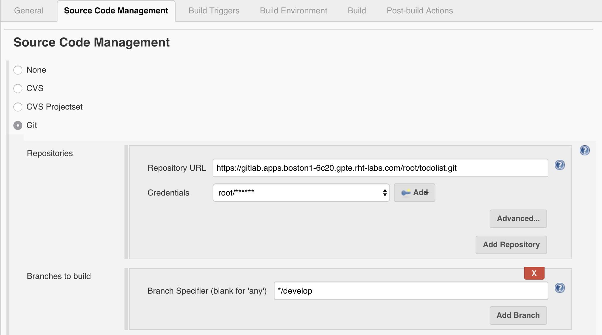

5. Scroll down to the Build Environment tab and select the `Color ANSI Console Output` checkbox 

5. Move on to the Build section and select `Add build step`. From the dropdown select `Execute Shell`. On the box that appears; insert the following, to build package and deploy our app to Nexus:
```bash
set -o xtrace
npm install
npm run build:ci:dev
npm run package
npm run publish
```


5. Scroll to the final section; the Post-build Actions. Add a new post-build action from the dropdown called `Archive the artifacts` and specify `**` in the box. This will zip the entire workspace and copy it back to Jenkins for inspection if needed. 

5. On the Post-build Actions; Add another post-build action from the dropdown called `Git Publisher`. This is useful for tying the git check-in to the feature in your tracking tool to the built product.
    * Tick the box `Push Only If Build Succeeds`
    * Add the Tag to push of
```bash
${JOB_NAME}.${BUILD_NUMBER}
```
    * Specify the commit message to be
```bash
Automated commit by jenkins from ${JOB_NAME}.${BUILD_NUMBER}
```

    * Check `Create New Tag` and set `Target remote name` to `origin`
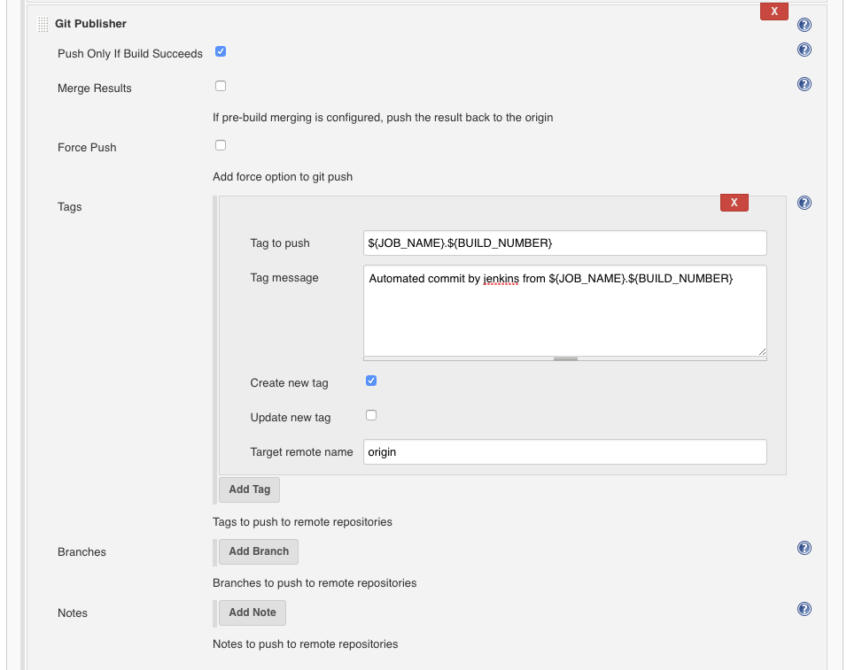

5. Finally; add the trigger for the next job in the pipeline. This is to trigger the bake job with the current build tag. Add another post-build action from the dropdown called `Trigger parameterized build on other projects`.
    * Set the project to build to be `dev-todolist-fe-bake`
    * Set the condition to be `Stable or unstable but not failed`.
    * Click Add Parameters dropdown and select Predefined parameters.
    * In the box, insert our BUILD_TAG as follows
```bash
BUILD_TAG=${JOB_NAME}.${BUILD_NUMBER}
```

<p class="tip">
    NOTE - Jenkins might say "No such project ‘dev-todolist-fe-bake’. Did you mean ...." at this point. Don't worry; it's because we have not created the next job yet.
</p>

5. Hit `save` which will take you to the job overview page - and that's it; our *build* phase is complete!

#### 3b - Bake

5. Next we will setup our *bake* phase; which is a little simpler. Go to Jenkins home and create another Freestyle Job (as before) called `dev-todolist-fe-bake`.

5. This job will take in the BUILD_TAG from the previous one so check the `This project is parameterized` box on the General tab.
    * Add string parameter type
    * set the Name to `BUILD_TAG`. This will be available to the job as an Enviroment Variable.
    * You can set `dev-todolist-fe-build.` as the default value for ease when triggering manually.
    * The description is not required but a handy one for reference would be `${JOB_NAME}.${BUILD_NUMBER} of previous build e.g. dev-todolist-fe-build.1232`
<p class="tip">
    NOTE - Don't forget to include the `.` after `dev-todolist-fe-build` in the Default Value box.
</p>


5. This time set the `Restrict where this project can be run` label to `master`.
<p class="tip">
    NOTE - `Master` is the default node that jobs run on. We don't want jenkins to execute the *bake* on any other nodes if the `master` is busy so it is always safer to specify it here.
</p>

5. There is no Git or SCM needed for this job so move down to the Build Environment and tick `Delete workspace before build starts`

5. Scroll down to the Build Environment tab and select the `Color ANSI Console Output` checkbox 

5. Move on to the Build section and select `Add build step`. From the dropdown select `Execute Shell`. On the box the appears; insert the following, to pull the package from Nexus. We patch the BuildConfig with the Jenkins Tag to get traceablility from feature to source code to built item. Finally; the oc start-build command is run:
Remember to replace `<YOUR_NAME>` accordingly.
```bash
#!/bin/bash
curl -v -f \
    http://admin:admin123@${NEXUS_SERVICE_HOST}:${NEXUS_SERVICE_PORT}/repository/zip/com/redhat/todolist/${BUILD_TAG}/package-contents.zip \
    -o package-contents.zip
unzip package-contents.zip
oc project <YOUR_NAME>-ci-cd
NAME=todolist-fe
oc patch bc ${NAME} -p "{\"spec\":{\"output\":{\"to\":{\"kind\":\"ImageStreamTag\",\"name\":\"${NAME}:${BUILD_TAG}\"}}}}"
oc start-build ${NAME} --from-dir=package-contents/ --follow
```
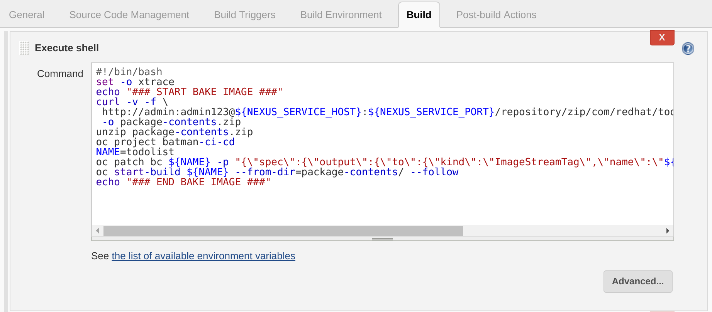

5. Finally; add the trigger for the next job in the pipeline. Add a post-build action from the dropdown called `Trigger parameterized build on other projects`.
    * Set the project to build to be `dev-todolist-fe-deploy`
    * Set the condition to be `Stable`.
    * Click Add Parameters dropdown and select `Current build parameters`. This will pass the `${BUILD_TAG}` to the downstream job which we will create next.
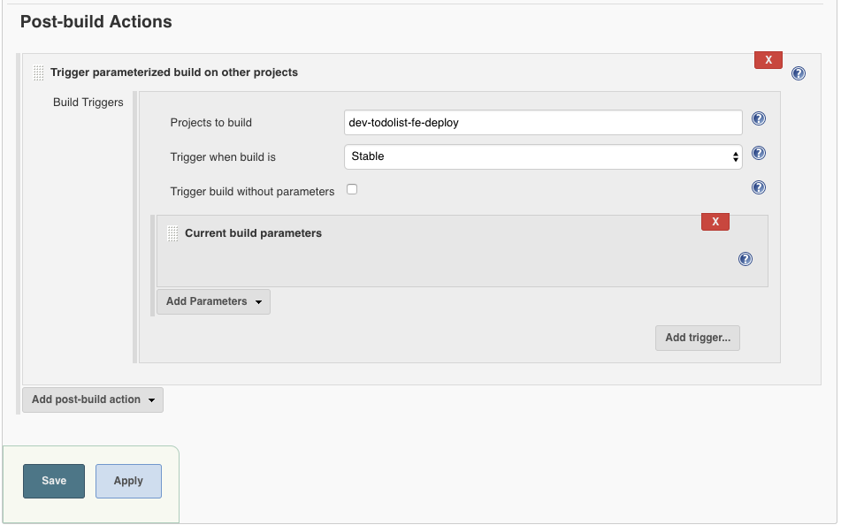

5. Hit save! That's our *bake* phase done! Finally; on to our *deploy*

#### 3c - Deploy

5. Next we will setup our *deploy* phase. This job is very similar in setup to the *bake* phase so this time go to Jenkins home and create `dev-todolist-fe-deploy` Job but scroll to the bottom and Copy from `dev-todolist-fe-bake`.
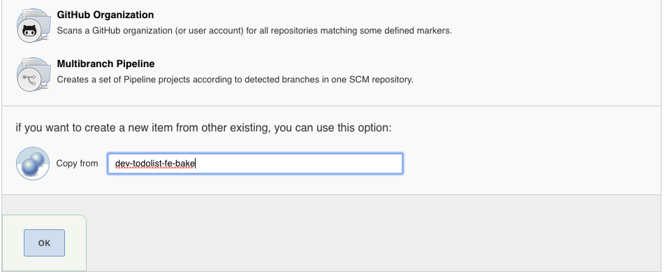

5. The only two differences between these jobs is the Build Step and there are no Post Build Actions. First to the Build tab and add the following to the shell box. The process for running the deploy is to tag the image created previously for use in the `ci-cd` namespace for use in the dev project. Then update the DeploymentConfig to use the Jenkins Tag which kicked the process off. Once successful; the changes are rolled out. Remember to change `<YOUR_NAME>` accordingly.
```bash
#!/bin/bash
set -o xtrace
# VARS
PIPELINES_NAMESPACE=<YOUR_NAME>-ci-cd
NAMESPACE=<YOUR_NAME>-dev
NAME=todolist-fe
oc project ${NAMESPACE}
oc tag ${PIPELINES_NAMESPACE}/${NAME}:${BUILD_TAG} ${NAMESPACE}/${NAME}:${BUILD_TAG}
oc set env dc ${NAME} NODE_ENV=dev
oc set image dc/${NAME} ${NAME}=docker-registry.default.svc:5000/${NAMESPACE}/${NAME}:${BUILD_TAG}
oc rollout latest dc/${NAME}
```


5. When a deployment has completed; OpenShift can verify its success. Add another step by clicking the `Add build Step` on the Build tab then `Verify OpenShift Deployment` including the following:
    * Set the Project to your `<YOUR_NAME>-dev`
    * Set the DeploymentConfig to your app's name `todolist-fe`
    * Set the replica count to `1`


5. Finally; delete the Post Build Action to trigger another job (by hitting the red X). Save the configuration. We're almost ready to run the pipeline!

#### 3d - Pipeline

5. With our Jenkins setup in place; now move to our `todolist-fe` app's source code. We have to add our configuration to the frontend to tell it where the API layer will be hosted. Open the source in your favourite editor and navigate to `src/config/dev.js`.

5. Update `<YOUR_NAME>` accordingly with the route where the Todo List API will live when it is deployed. The correct full URL can also be found on the OpenShift Console; if you copy it from there remember to append `/api/todos` to the URL. For example:


5. Repeat this for `src/config/test.js` file. If you copy the URL from the previous step; change `dev` to `test`.
For example:


5. With the config in place; commit your changes and push them to GitLab:
```bash
git add .
```
```bash
git commit -m "ADD config for api"
```
```bash
git push
```

5. Back on Jenkins; We can tie all the jobs in the pipeline together into a nice single view using the Build Pipeline view. Back on the Jenkins home screen Click the + beside the all tab on the top.


5. On the view that loads; Give the new view a sensible name like `dev-todolist-fe-pipeline` and select Build Pipeline View


5. Set the Pipeline Flow's Inital Job to `dev-todolist-fe-build` and save.


5. You should now see the pipeline view. Run the pipeline by hitting run (you can move onto the next part while it is running as it may take some time).


6. To check the deployment in OpenShift; open the web console and go to your `dev` namespace. You should see the deployment was successful; hit the URL to open the app (the screenshot below has both apps deployed).
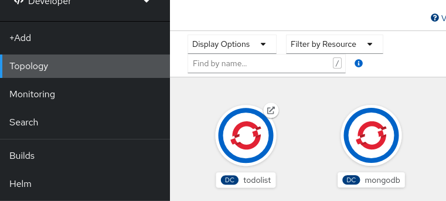

6. If it has been a success we should see our dummyData. This is because there is no backend deployed, in later labs we will deploy the backend and the mongodb for persistence but to do this we will use Jenkins Pipeline as code.
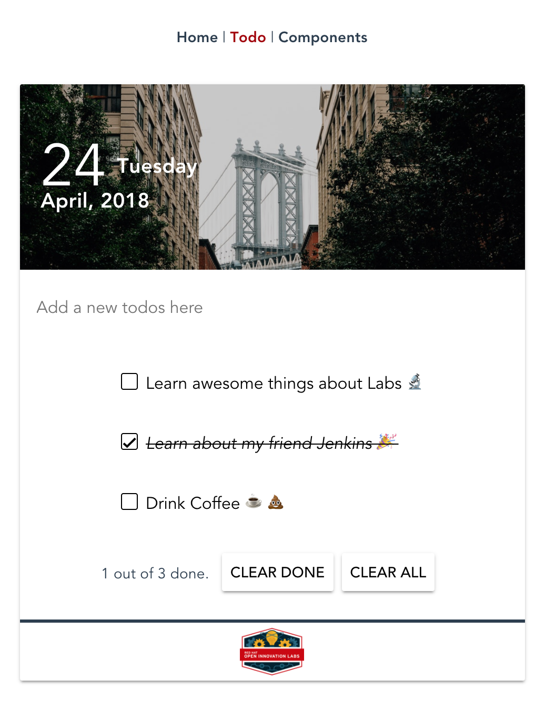

### Part 4 - (Optional) GitLab Webhooks
> _In this exercise we will link GitLab to Jenkins so that new build jobs are triggered on each push to the `develop` branch._

<p class="tip" >
NOTE - This section is optional! Git webhooks are useful but not needed for Enablement completion.
</p>

7. In order to allow GitLab to trigger Jenkins (because of the OpenShift Auth Plugin), we need to allow the `Anonymous` user triggered builds. Head to your Jenkins Dashboard and click on `Manage Jenkins` on the left hand side. Then scroll down and click `Configure Global Security`. Alternatively, type in `https://jenkins-<YOUR_NAME>-ci-cd.apps.some.domain.com/configureSecurity/` . You should see a screen like so:
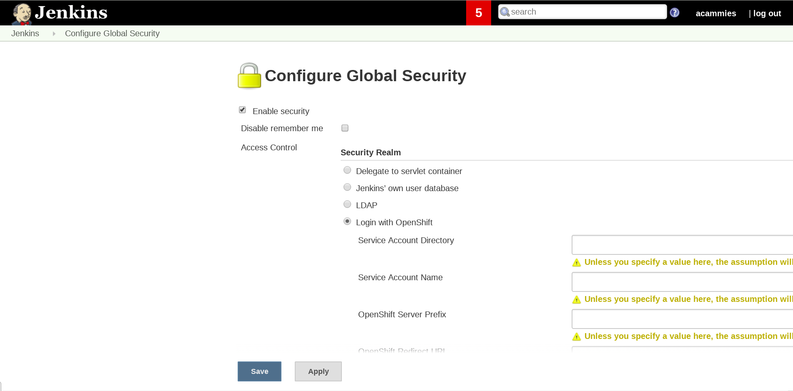

7. Scroll down to the `Authorization` section and allow `Anonymous` to create jobs. Do this by navigating through the matrix of checkboxes and check `Build` and `Cancel` under the Job heading. Leave all other user behaviour as is. Anonymous is the user that GitLab will act as so this allows the WebHook to trigger builds. (The screenshot has been cropped to bring Job further to the left.) Hit `Save` or `Apply`.
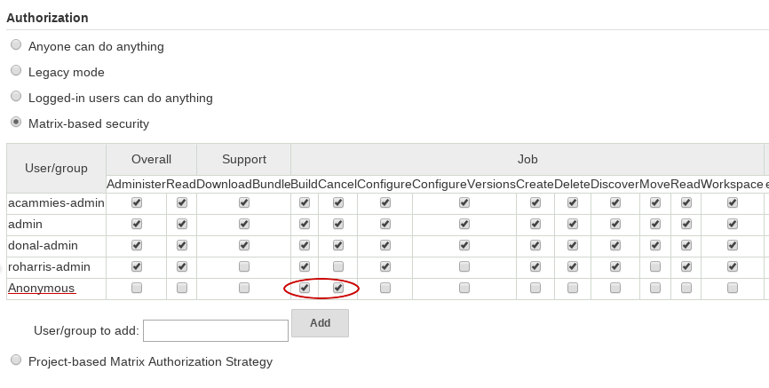

7. Go to your `dev-todolist-fe-build` and head to the `configure` section (`https://jenkins-<YOUR_NAME>-ci-cd.apps.some.domain.com/job/dev-todolist-fe-build/configure`). Scroll down to the `Build Triggers` section and check the `Build when a change is pushed to GitLab` box. Leave all the other settings as they are but copy the `GitLab webhook URL`. `https://jenkins-<YOUR_NAME>-ci-cd.apps.some.domain.com/project/dev-todolist-fe-build`. Remember to Save and Apply this change.
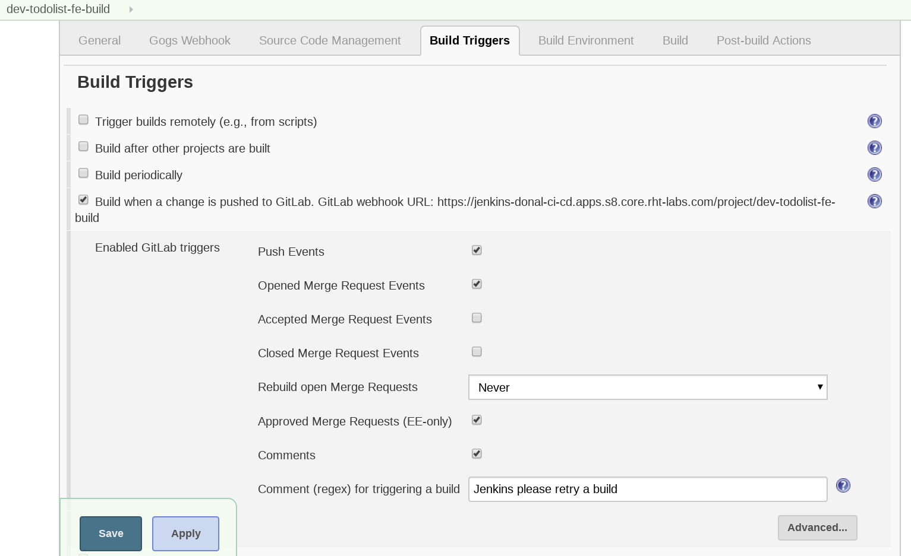

7. Switch over to GitLab and select your `todolist-fe` repository. On the left hand task bar hover over the settings cog and select `integrations`. (`https://gitlab-<YOUR_NAME>-ci-cd.apps.some.domain.com/<YOUR_NAME>/todolist-fe/settings/integrations`)


7. Paste the `GitLab webhook URL` that we copied earlier into the `URL` field. Check Push events as the trigger, and make sure you `uncheck` the `SSL verification` checkbox. Click Add webhook at the bottom.
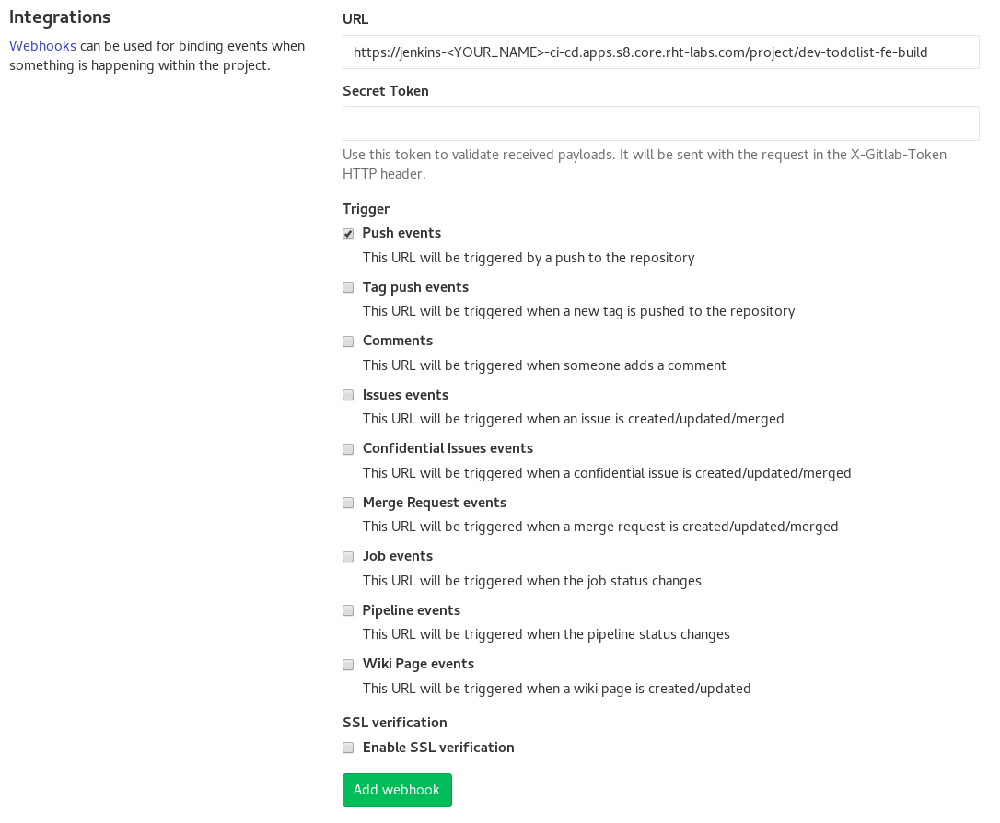

7. Before we move on let's test the webhook. Select the Test drop down and click `Push events`. This will trigger the test and return a status code at the top of the page. If all goes well it should be a cool blue 200.
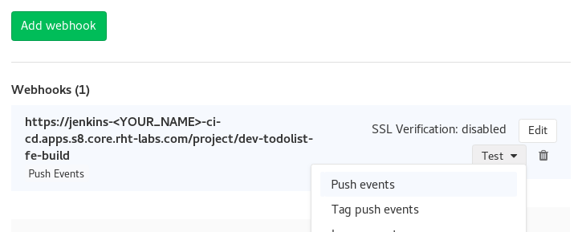

7. We can now test this properly by heading into the `todolist-fe` repository through <YOUR_FAVOURITE_EDITOR>. Make a small change to your code, then commit and push it, ensuring you're on the develop branch. Then head over to Jenkins and wait until the `dev-todolist-fe-build` job has been triggered.

7. We now have a working GitLab webhook so any time we push code it will automatically build! Next up we'll show you how to add tests to your pipeline.

_____

## Extension Tasks
> _Ideas for go-getters. Advanced topic for doers to get on with if they finish early. These will usually not have a solution available and are provided for additional scope._

- Pipeline Tasks
    * Add pipeline for `master` branch for each project. Use `test-` instead of `dev-` across all config and names in the pipeline
    * Do the `.openshift-applier` steps as part of the pipeline for greater end to end automation.
- Promote build
    * Create a _promote-to-uat_ phase after the `master` branch deploy
    * Create a `uat` env using the OpenShift Applier as seen before
    * Tag and promote the image without rebuilding after the `test-**-deploy`
- MongoDB tasks
    * Add MongoDB Stateful set for the UAT environment (or test)
    * Inject MongoDB config into the NodeJS app using config map & secrets.
    * Improve the security of the DB by making the user /passwords randomly generated
- Setup Nexus as an `npm` mirror registry and use it in the builds to speed up the build time

## Additional Reading
> List of links or other reading that might be of use / reference for the exercise

## Slide links

- [Intro](https://docs.google.com/presentation/d/1t1CONuy-_IRPZYmU010Qgk2rshiDJTennvLyQR8GllE)
- [Wrap-up](https://docs.google.com/presentation/d/1kZ8SV6iJnrKk_AqPpyPuNZifv7VzItHOB9HYdOnNJjI)
- [All Material](https://drive.google.com/drive/folders/1lf66ks2tT0eQ4A9RSU48u0ZhvBXzoHWJ)
