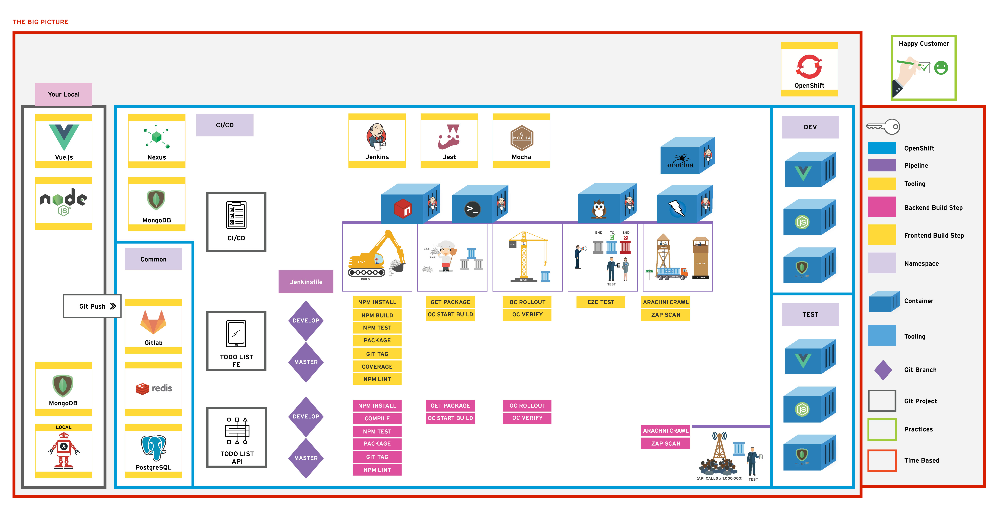
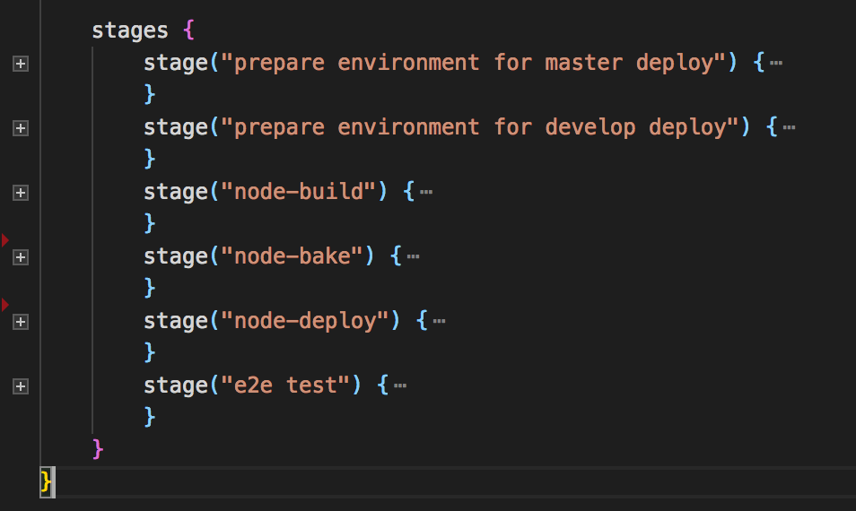
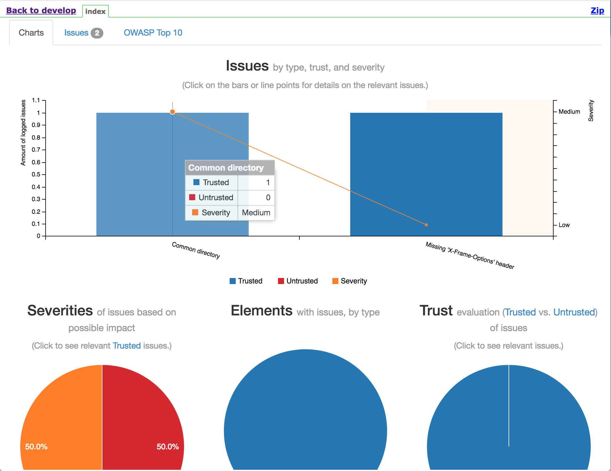
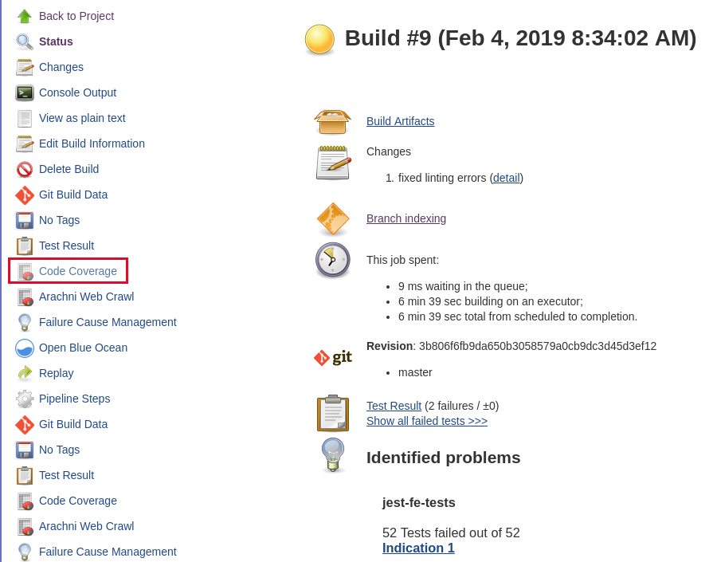
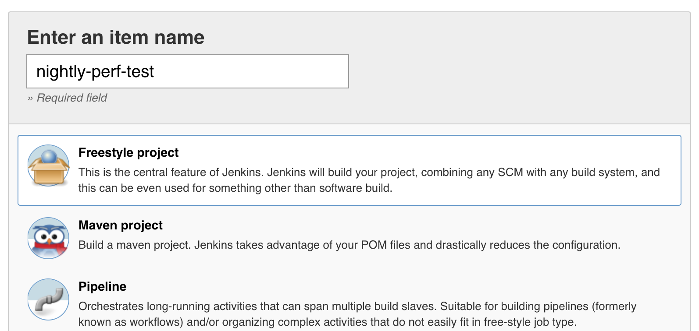
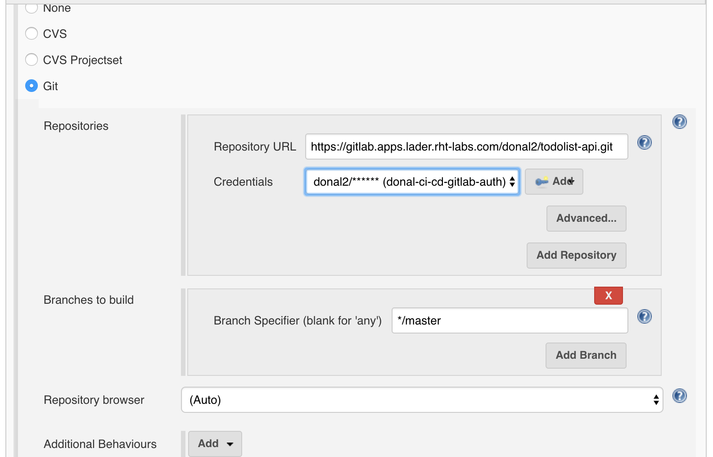

# The Non-Functionals Strike back
> In this exercise we explore the non-functional side of testing.


## Exercise Intro
Non-functional testing provides valuable insights into code quality and application performance. Often overlooked but usually one of the most essential types of testing, non-functional testing types can include, but are not limited to
- Performance Testing
- Security testing
- Static Code analysis
- Vulnerability scanning

There are many tools out there for supporting these testing types but often they are left to the end of a delivery. Many traditional projects will leave Performance testing or security sign off to a few weeks before Go Live. This raises the question of what do we do if things do not pass these tests? Do we hold off the Go Live or accept the risk? In most cases we can learn earlier if things will be show stoppers and more importantly we can automate them.

For example; imagine a developer called `Sam` has checked in some poorly performing function into an API that spikes its response time. Let's call this `Sam Code`. This `Sam Code` may not be caught by our Unit Tests but could have very big impact on application usability. Before building code on top this and it becoming more of an issue at the end of a project; we could code and capture metrics around API response time and track these over time and hopefully spot regressions earlier.

Another one of the age old questions is "How do we know we're testing enough?". Well the simple answer is you can never do enough testing! But how do we know we are testing the right things? Code coverage metrics can be run on our application while running the tests. They can identify what files are being tested and a line by line of how many times a test executes against a block of code. Reporting these metrics in our pipeline gives a greater handle on the quality of our testing.

Static code analysis can provide great insights into the quality of the code we've written. By analysing code without executing it bugs and common gotchas can be identified. Code complexity can be assessed using tooling such as SonarQube. Linting of code is a useful thing for non compiled languages such as JavaScript and can be executed in a build to provide some feedback.

Integrating these tools into the developer workflow can greatly improve quality and readability of code. Putting them in the pipeline ensures they are executed - removing the _"It works on my machine"_ view some may take.

#### Why run non functional tests?
- Early identify common code gotchas and pitfalls
- Tighten our feedback loop by executing non functional tests earlier in a project lifecycle
- Improve Code readability with agreeing a coding standard and then codifying it.
- Improve trust in the code quality and bring together security teams with dev teams earlier
- They can be automated; so why not run them as part of a build!

_____

## Learning Outcomes
As a learner you will be able to
- Create additional Jenkins stages to scan for security vulnerabilities in the Apps
- Assess test quality by producing coverage reports as part of a build
- Improve code readability with linting
- Do some light performance testing to monitor throughput of APIs

## Tools and Frameworks
> Below is a collection of the new frameworks and tools that will be used in this exercise

1. [eslint](https://eslint.org/) - ESLint is an open source JavaScript linting utility originally created by Nicholas C. Zakas in June 2013. Code linting is a type of static analysis that is frequently used to find problematic patterns or code that doesn’t adhere to certain style guidelines. There are code linters for most programming languages, and compilers sometimes incorporate linting into the compilation process.
1. [Zed Attack Proxy](https://www.owasp.org/index.php/OWASP_Zed_Attack_Proxy_Project) - The OWASP Zed Attack Proxy (ZAP) is one of the world’s most popular free security tools and is actively maintained by hundreds of international volunteers*. It can help you automatically find security vulnerabilities in your web applications while you are developing and testing your applications. Its also a great tool for experienced pentesters to use for manual security testing.
2. [Arachni Crawler](http://www.arachni-scanner.com/) - Arachni is a feature-full, modular, high-performance Ruby framework aimed towards helping penetration testers and administrators evaluate the security of modern web applications. It is free, with its source code public and available for review. It is versatile enough to cover a great deal of use cases, ranging from a simple command line scanner utility, to a global high performance grid of scanners, to a Ruby library allowing for scripted audits, to a multi-user multi-scan web collaboration platform. In addition, its simple REST API makes integration a cinch.
<!-- 1. [stryker](http://stryker-mutator.io/) - Mutation testing! What is it? Bugs, or mutants, are automatically inserted into your production code. Your tests are run for each mutant. If your tests fail then the mutant is killed. If your tests passed, the mutant survived. The higher the percentage of mutants killed, the more effective your tests are. It's really that simple. -->

## Big Picture
> In the previous exercise; we introduced pipeline-as-code and new Jenkins Slave nodes. This exercise focuses on extending the pipeline with non-functional testing and some automated security testing.



_____

<!-- ## 10,000 Ft View
> This lesson will use the Arachni scanner to improve the pipeline. Linting will be included in the build and code coverage too.

1. Add a new stage after the e2e tests on the front end to run the Arachni scanner against the deployed apps.

2. Add Code Coverage reporting to the build for gaining greater insight into test improvements.

3. Add `npm run lint` to the Frontend and report the result in Jenkins.

4. Create a new Jenkins job to run some light performance testing against the API layer using the perf tests tasks. -->

## Step by Step Instructions

### Part 1 - Add Security scanning to the pipeline
> _In this exercise, the first of our non-functional testing is explored in the form of some security scanning. We will add the scan to our Jenkinsfile and have them run as a new stage_

1. Open the `todolist` application's `Jenkinsfile` in your cloud ide. The file is stored in the root of the project.

2. The file is laid out with a collection of stages that correspond to each part of our build as seen below. We will create a new parallel stage to execute both our `Arachni` and our `Zap` scan.


3. Create a new stage called `Security Scan` underneath the `stage("e2e test") { }` section as shown below. This is a parallel stage which will allow us to define additional `stages() {}` inside of it. We will add two stages in there, one for `Zap` and one for `Arachni`. The contents of the `e2e test` have been removed for simplicity.

<kbd>📝 *todolist/Jenkinsfile*</kbd>
```groovy
        stage("e2e test") {
            // ... stuff in here ....
        }
        stage('Security Scan') {
            parallel {
                stage('OWASP Zap') {

                }
                stage('Arachni') {

                }
            }
        }
```

4. Let's start filling out the configuration for the OWASP Zap scan first. We will set the label to our slave created in previous exercise and a `when` condition to only execute the job when on either the master or develop branch.

<kbd>📝 *todolist/Jenkinsfile*</kbd>
```groovy
stage('OWASP Zap') {
    agent {
        node {
            label "jenkins-slave-zap"
        }
    }
    when {
        expression { GIT_BRANCH ==~ /(.*master|.*develop)/ }
    }
}
```

5.  Add a `step` with a `sh` command to run the tool by passing in the URL of the app we're going to test.

<kbd>📝 *todolist/Jenkinsfile*</kbd>
```groovy
stage('OWASP Zap') {
        agent {
            node {
                label "jenkins-slave-zap"
            }
        }
        when {
            expression { GIT_BRANCH ==~ /(.*master|.*develop)/ }
        }
        steps {
            sh '''
                export REPORT_DIR="$WORKSPACE/"
                /zap/zap-baseline.py -r index.html -t ${E2E_TEST_ROUTE} || return_code=$?
                echo "exit value was  - " $return_code
            '''
        }
}
```

6.  Finally add the reporting for Jenkins in `post` hook of our Declarative Pipeline. This is to report the findings of the scan in Jenkins as an HTML report.

<kbd>📝 *todolist/Jenkinsfile*</kbd>
```groovy
stage('OWASP Scan') {
    agent {
        node {
            label "jenkins-slave-zap"
        }
    }
    when {
        expression { GIT_BRANCH ==~ /(.*master|.*develop)/ }
    }
    steps {
        sh '''
            export REPORT_DIR="$WORKSPACE/"
            /zap/zap-baseline.py -r index.html -t http://${E2E_TEST_ROUTE} || return_code=$?
            echo "exit value was  - " $return_code
        '''
    }
    post {
        always {
          // publish html
          publishHTML target: [
              allowMissing: false,
              alwaysLinkToLastBuild: false,
              keepAll: true,
              reportDir: '',
              reportFiles: 'index.html',
              reportName: 'Zap Branniscan'
            ]
        }
    }
}
```

7. Let's add our Arachni Scan to the second part of the parallel block. The main difference between these sections is Jenkins will report an XML report too for failing the build accordingly. Below is the snippet for the Arachni scanning.

<kbd>📝 *todolist/Jenkinsfile*</kbd>
```groovy
    stage('Arachni') {
        agent {
            node {
                label "jenkins-slave-arachni"
            }
        }
        when {
            expression { GIT_BRANCH ==~ /(.*master|.*develop)/ }
        }
        steps {
            sh '''
                /arachni/bin/arachni http://${E2E_TEST_ROUTE} --report-save-path=arachni-report.afr
                /arachni/bin/arachni_reporter arachni-report.afr --reporter=xunit:outfile=report.xml --reporter=html:outfile=web-report.zip
                unzip web-report.zip -d arachni-web-report
            '''
        }
        post {
            always {
                junit 'report.xml'
                publishHTML target: [
                    allowMissing: false,
                    alwaysLinkToLastBuild: false,
                    keepAll: true,
                    reportDir: 'arachni-web-report',
                    reportFiles: 'index.html',
                    reportName: 'Arachni Web Crawl'
                    ]
            }
        }
    }
```

8. With this config in place, commit your code (from your terminal). Wait for a few minutes until a new build in Jenkins is trigerred:

```bash
cd /projects/todolist
```
```bash
git add .
```
```bash
git commit -m "ADD - security scanning tools to pipeline"
```
```bash
git push
```

5. Check out the Blue Ocean Jenkins view for how the new stage is viewed!


6. Once the Jobs have completed; navigate to the Jobs status and see the scores. You can find the graphs and test reports on overview of the Job. Explore the results!



<p class="tip">
NOTE - your build may have failed, or marked as unstable because of the a security failure but the reports should still be generated, it is OK to proceed with the next exercise!
</p>


### Part 2 - Add Code Coverage & Linting to the pipeline
> _Let's continue to enhance our pipeline with some non-functional testing. Static code analysis and testing coverage reports can provide a useful indicator on code quality and testing distribution_

1. Coverage reports are already being generated as part of the tests. We can have Jenkins produce a HTML report showing in detail where our testing is lacking. Open the `todolist` in your favourite editor.

2. Open the `Jenkinsfile` in the root of the project; move to the `stage("node-build"){ ... }` section. In the `post` section add a block for producing a `HTML` report as part of our builds. This is all that is needed for Jenkins to report the coverage stats.

<kbd>📝 *Jenkinsfile*</kbd>
```groovy
    // Post can be used both on individual stages and for the entire build.
    post {
        always {
            archive "**"
            junit 'test-report.xml'
            // publish html
            publishHTML target: [
                allowMissing: false,
                alwaysLinkToLastBuild: false,
                keepAll: true,
                reportDir: 'reports/coverage',
                reportFiles: 'index.html',
                reportName: 'Code Coverage'
            ]
        }
```

3. To get the linting working; we will add a new step to our `stage("node-build"){ }` section to lint the JavaScript code. Continuing in the `Jenkinsfile`, After the `npm install`; add a command to run the linting.
```groovy
echo '### Install deps ###'
sh 'npm install'
echo '### Running linting ###'
sh 'npm run lint'
```

4. Save the `Jenkinsfile` and commit it to trigger a build with some more enhancements.
```bash
git add .
```
```bash
git commit -m "ADD - linting and coverage to the pipeline"
```
```bash
git push
```

5. A new Jenkins build is trigerred and the pipeline fails. Look in the Jenkins log for what the issue might be:


6. Fix the error identified by the linter by commenting out the offending line. Commit and push your changes to trigger a new build.

7. Once the build passes again, view the coverage graph; go to the job's build page and open the `Code Coverage` report from the nav bar on the side. Sometimes this won't display on the `yourjenkins.com/job/todolist/job/branch/` sidebar, click on an individual build in the build history and it should appear on the side navbar.


8. Open the report to drill down into detail of where testing coverage could be improved!

<p class="tip">
NOTE - a good practice for teams is to try and increase the code coverage metrics over the life of a project. Teams will often start low and use practices such as retrospective to increase the quality at specific times.
</p>


### Opional Exercise - Nightly light performance testing
> _In this part of the exercise, we will execute light performance tasks in our API to collect data about throughput time in hopes if the API ever has some `Sam` quality code checked in, we will spot it_

An arbitrary value for the APIs to respond in has been chosen. It is set in the `todolist/tasks/perf-test.js` file. In this exercise we will get Jenkins to execute the tests and fail based on the score set there!

1. Create a new Item on Jenkins, `nightly-perf-test` and make it a freestyle job.


2. Set the `label` on `Restrict where this project can be run` to `jenkins-slave-npm` one used by the build jobs previously.


3. In the SCM section; set the project to use the `todolist` git project. Set the credentials accordingly.


4. Set the build to execute each night; for example 0300 in the morning. Hit `Build periodically` on the Build Triggers section and set it to `H 3 * * *`.


5. Set the `Color ANSI Console Output` on the Build Environment section.

6. Click `add build step` and select `execute shell` and add the following to it, replacing `<YOUR_NAME>` as expected. We will just test the `create` and `show` API for the moment. We are grabbing the response code of the perf-test to keep Jenkins running both shells steps and then exiting with whichever fails:
```bash
export E2E_TEST_ROUTE=todolist-<YOUR_NAME>-dev.<APPS_URL>
npm install
set +e
npm run perf-test:create
rc1=$?
npm run perf-test:show
rc2=$?
set ­-e
exit $(($rc1 | $rc2))
```

7. On the Post Build actions section we will plot the data from the perf tests in Jenkins. Add a `Post-build Action > Plot Build Data`.

8. On the new dialog, name the Plot group e.g. `bench-tests` and add `create­-api` as the Plot title. Set the `Number of Builds to Include` to a large number like `100`. Set the Data Series file to be `reports/server/perf/create-perf-score.csv` and mark the `Load data from CSV field` checkbox. Apply those changes


9. Hit `Add Plot` to add another. Set Plot group to `bench-tests` again but this time setting the Plot title to `show­-api`. Set the Data Series file to be `reports/server/perf/show-perf-score.csv` and mark the `Load data from CSV` radio button. Save those changes and run the job (Job could take a while to execute!).

10. Run it a few times to start to generate the data points on the plot. The `bench-tests` plot is available on the job's homepage


_____

## Extension Tasks
> _Ideas for go-getters. Advanced topic for doers to get on with if they finish early. These will usually not have a solution and are provided for additional scope._

 - Enhance the `todolist` with the security scanning tools as you've done for the `todolist`
 - Enhance the `todolist` with the coverage reporting as you've done for `todolist`
 - Add Black Duck or other package scanning tooling for our NodeJS app
 - Add Container Vulnerability scanning tooling to the pipeline
 - Add `Stryker` to create mutants and do additional non functional testing of the App
 - Add the Checkstyle plugin to Jenkins for reporting scores

<!-- ## Additional Reading
> List of links or other reading that might be of use / reference for the exercise

## Slide Links

- [Intro](https://docs.google.com/presentation/d/1YQ0hUV3o7DW8O40SiI-BQZXCOSVeQGjo2iTxCL2GZfk/)
- [Wrap-up](https://docs.google.com/presentation/d/102hRHDlC9PUIsMs3m1fZy8QUaB5UKzBlhBPdehRWw38/)
- [All Material](https://drive.google.com/drive/folders/1seT0V3ABHNonvtFvORNt836NgSeYPuWW) -->
