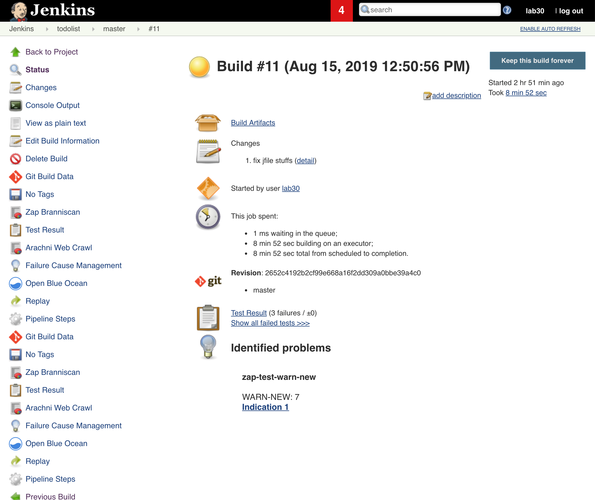
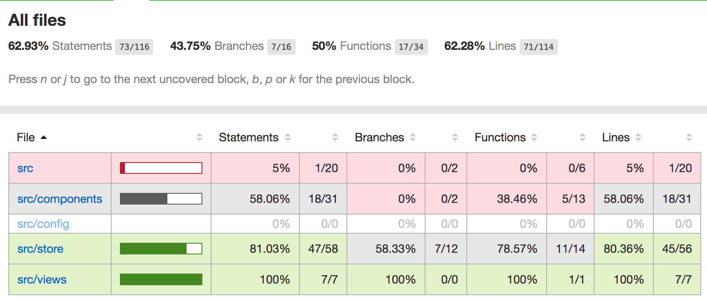
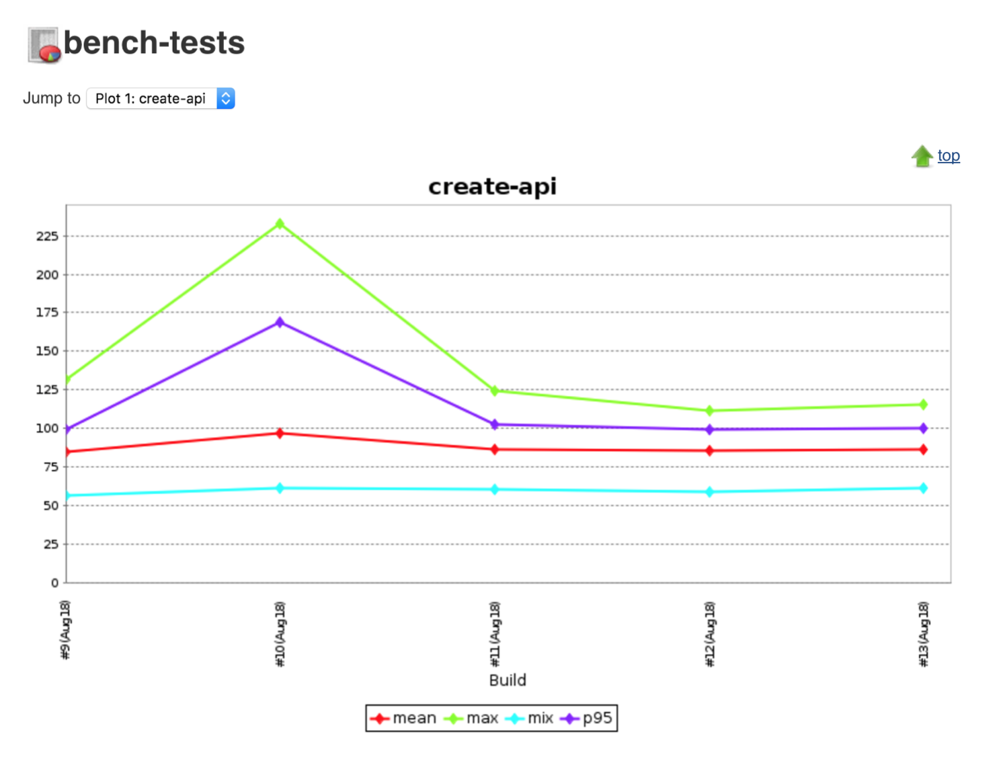

# The Non Functionals Strike back
> In this exercise we explore the non-functional side of testing.
_____

## Learning Outcomes
As a learner you will be able to
- Create additional Jenkins stages to scan for security vulnerabilities in the Apps
- Assess test quiality by producing coveage reports as part of a build
- Improve code readability with linting
- Do some light performance testing to monitor throughput of APIs

## Tools and Frameworks
> Below is a collection of the frameworks that will be used in this lab

1. [eslint](https://eslint.org/) - ESLint is an open source JavaScript linting utility originally created by Nicholas C. Zakas in June 2013. Code linting is a type of static analysis that is frequently used to find problematic patterns or code that doesn’t adhere to certain style guidelines. There are code linters for most programming languages, and compilers sometimes incorporate linting into the compilation process.

## Big Picture
This exercise begins cluster containing blah blah

_____

## 10,000 Ft View
> This lesson will use the Exerisise 4's Zap Slave and Arachni scanner to improve the pipeline. Linting will be included in the build and code coverage too.

2. Add a parallel stage after the e2e tests on the front end to run OWASP Zap and Arachni against the deployed apps.

2. Add Code Coverage reporing to the build for gaining greater insight into test improvements.

2. Add `npm run lint:ci` to the Frontend and report the result using the Checkstyle Plugin in Jenkins.

2. Create a new Jenkins job to run some light performance testing against the API layer using the perf tests tasks.

## Step by Step Instructions
> This is a well structured guide with references to exact filenames and indications as to what should be done.

### Part 1 - Add Security scanning to the pipeline 
> _In this exercise the first of our non-functional testing is explored in the form of some security scanning. We will add the scans to our Jenkinsfile and have them run as new stages_

2. Open the `todolist-fe` application's `Jenkinsfile` in your favourite editor. The file is stored in the root of the project.

2. The file is layed out with a collection of stages that correspond to each part of our build as seen below. We will create a new stage to execute in parallel.


2. Create a new Parallel Stage called `security scanning` underneath the `stage("e2e test") { }` section as shown below. The contents of the `e2e test` has been removed for simplicity. 
```groovy
        stage("e2e test") {
            // ... stuff in here ....
        }
        stage("security scanning") {
            parallel {
                stage('OWASP Scan') {

                }
                stage('Arachni Scan') {

                }
            }
        }
```

2. Let's start filling out the configuration for the OWASP Zap scan first. We will set the label to our slave created in previous exercise and a when condition of the mater or develop branch.
```groovy
stage('OWASP Scan') {
    agent {
        node {
            label "jenkins-slave-zap"
        }
    }
    when {
        expression { GIT_BRANCH ==~ /(.*master|.*develop)/ }
    }
}
```

2.  A command to run the tool by passing in the URL of the app we're going to test.
```groovy
stage('OWASP Scan') {
    agent {
        node {
            label "jenkins-slave-zap"
        }
    }
    when {
        expression { GIT_BRANCH ==~ /(.*master|.*develop)/ }
    }
    steps {
        sh '''
            /zap/zap-baseline.py -r index.html -t ${E2E_TEST_ROUTE}
        '''
    }
}
```

2.  Finally add the reporting for Jenkins in `post` hook of our Declarative Pipeline. This is to report the findings of the scan in Jenkins as a HTML report.
```groovy
stage('OWASP Scan') {
    agent {
        node {
            label "jenkins-slave-zap"
        }
    }
    when {
        expression { GIT_BRANCH ==~ /(.*master|.*develop)/ }
    }
    steps {
        sh '''
            /zap/zap-baseline.py -r index.html -t http://${E2E_TEST_ROUTE}
            exit $?
        '''
    }
    post {
        always {
          // publish html
          publishHTML target: [
              allowMissing: false,
              alwaysLinkToLastBuild: false,
              keepAll: true,
              reportDir: '/zap/wrk',
              reportFiles: 'index.html',
              reportName: 'Zap Branniscan'
            ]
        }
    }
}
```

2. Let's add our Arachni Scann to the second part of the parallel block. The main difference between these sections is Jenkins will report an XML report too for failing the build accordingly. Below is the snippet for the Arachni scanning.
```groovy
    stage('Arachni Scan') {
        agent {
            node {
                label "jenkins-slave-arachni"
            }
        }
        when {
            expression { GIT_BRANCH ==~ /(.*master|.*develop)/ }
        }
        steps {
            sh '''
                /arachni/bin/arachni http://${E2E_TEST_ROUTE} --report-save-path=arachni-report.afr
                /arachni/bin/arachni_reporter arachni-report.afr --reporter=xunit:outfile=report.xml --reporter=html:outfile=web-report.zip
                unzip web-report.zip -d arachni-web-report
            '''
        }
        post {
            always {
                junit 'report.xml'
                publishHTML target: [
                    allowMissing: false,
                    alwaysLinkToLastBuild: false,
                    keepAll: true,
                    reportDir: 'arachni-web-report',
                    reportFiles: 'index.html',
                    reportName: 'Arachni Web Crawl'
                    ]
            }
        }
    }
```

2. With this config in place run a build on Jenkins. To do this; commit your code (from your terminal):
```bash
$ git add .
$ git commit -m "ADD - security scanning tools to pipeline"
$ git push
```

2. Once the Jobs have completed; navigate to the Jobs status and see the scores. You can find the graphs and test reports on overview of the Job. Explore the results!



<p class="tip">
NOTE - your build may have failed but the reports should still be generated!
</p>

### Part 2 - Add Code Coverage & Linting to the pipeline
> _Let's continue to enhance our pipeline with some non-functional testing. Static code analysis and testing coverage reports can provide a useful indicator on code quality and testing distribution_

3. Coverage reports are already being generated as part of the tests. We can have Jenkins produce a HTML report showing in detail where our testing is lacking. Open the `todolist-fe` in your favourite editor.

3. Open the `Jenkinsfile` in the root of the project; move to the `stage("node-build"){ ... }` section. In the post section add a block for producing a `HTML` report as part of our builds.
```groovy
    // Post can be used both on individual stages and for the entire build.
    post {
        always {
            archive "**"
            junit 'test-report.xml'
            // publish html
            publishHTML target: [
                allowMissing: false,
                alwaysLinkToLastBuild: false,
                keepAll: true,
                reportDir: 'reports/coverage',
                reportFiles: 'index.html',
                reportName: 'Code Coverage'
            ]
        }
```

3. We will add a new step to our `stage("node-build"){ }` section to lint the Javascript code. After the `npm install`; add a command to run the linting.
```groovy
echo '### Install deps ###'
sh 'npm install'
echo '### Running linting ###'
sh 'npm run lint:ci'
```

3. Save the `Jenkinsfile` and commit it to trigger a build with some more enhancements.
```bash
$ git add .
$ git commit -m "ADD - linting and coverage to the pipeline"
$ git push
```

3. To view the resulting graph; go to the job's build page and open the `Code Coverage` report from the nav bar on the side. Open the report to drill down into detail of where testing coverage could be improved! 

<p class="tip">
NOTE - a good practice for teams is to try and increase the code coverage metrics over the life of a project. Teams will often start low and use practices such as retrospective to increase the quality at specific times. 
</p>

3. (Optional Step) - Install the Checkstyle plugin; and add `checkstyle pattern: 'eslint-report.xml'` below the `publishHTML` block to add reporting to Jenkins!

### Part 3 - Nightly light performance testing
> _In this exercise, we will execute the light performance tasks in our API to collect data about throughtput time in hopes if the API ever has some `Sam` quality code checked in, we will spot it_

4. Create a new Item on Jenkins, `nightly-perf-test`

4. Set the label for where this job can execute to the `jenkins-slave-npm` one used by the build jobs previously.

4. In the SCM section; set the project to use the `todolist-api` git project. Set the credentials accordingly.

4. Create a step to execute shell and add the following to it, replacting `<YOUR_NAME>` and `somedomain` as expected. We will just test the create and show API for the moment. We are grabbing the response code of the perf-rest to keep Jenkins running both shells steps and then exiting with whichever fails:
```bash
export E2E_TEST_ROUTE=todolist-api-<YOUR_NAME>-dev.apps.somedomain.com
npm install
set +e
npm run perf-test:create
rc1=$?
npm run perf-test:show
rc2=$?
set ­-e
exit $(($rc1 | $rc2))
```

4. On the Post Build actions section we will plot the data from the perf tests in Jenkins. Add a `Post-build Action > Plot Build Data`.

4. On the new dialog, name the Plot group eg `benchmark­-tests` and add `create­-api` as the Plot title. Set the Number of Builds to Include to a large number like `100`. Set the Data Series file to be `reports/server/perf/create­-perf­-score.csv` and mark the Load data from CSV checkbox. Apply those changes


4. Hit `Add Plot` to add another. Fill out the information again but this time setting the Plot title to `show­-api`. Keep the Plot group the same as before: `bench­-tests`. Set the Data Series file to be `reports/server/perf/show­-perf­-score.csv` and mark the `Load data from CSV checkbox`. Save those changes and run the job (Job could take a while to execute!).

4. Run it a few times to start to generate the data points on the plot. The `bench-tests` plot is available on the job's homepage


_____

## Extension Tasks
> _Ideas for go-getters. Advanced topic for doers to get on with if they finish early. These will usually not have a solution and are provided for additional scope._

 - Enhance the `todolist-api` with the security scanning tools as you've done for the `todolist-api`
 - Enhance the `todolist-api` with the coverage reporting as you've done for `todolist-api`
 - Add Black Duck or other package scanning tooling for our NodeJS app
 - Add Container Vulnerability scanning tooling to the pipeline
 - Add `Stryker` to create mutants and do additional non functional testing of the App
 - Add the Checkstyle plugin to Jenkins for reporting scores

## Additional Reading
> List of links or other reading that might be of use / reference for the exercise

## Slide links
> link back to the deck for the supporting material