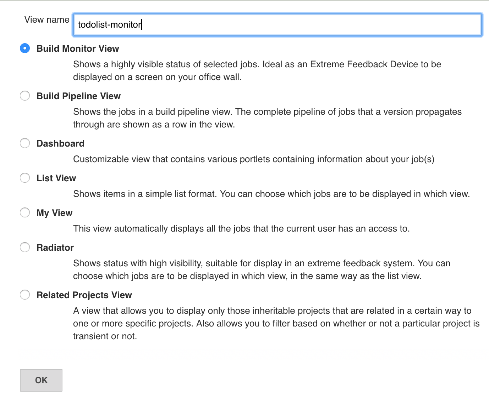
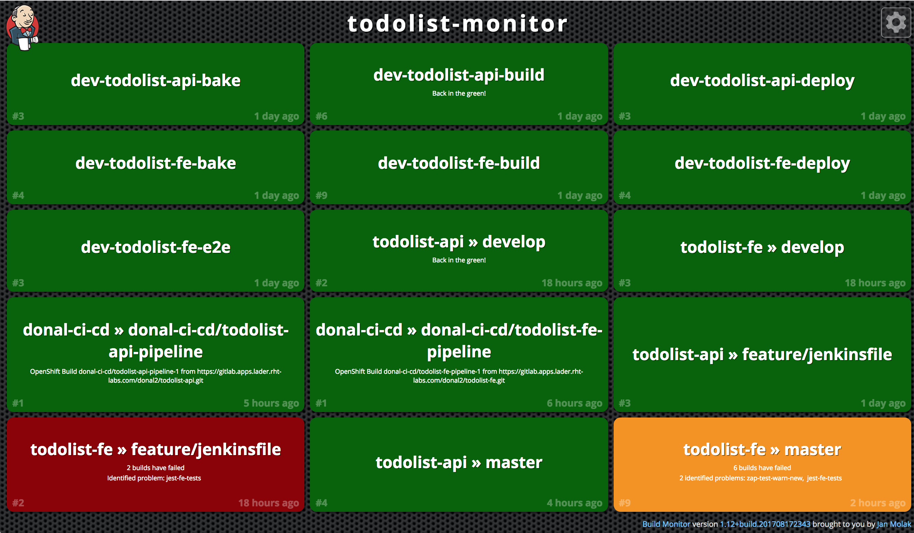
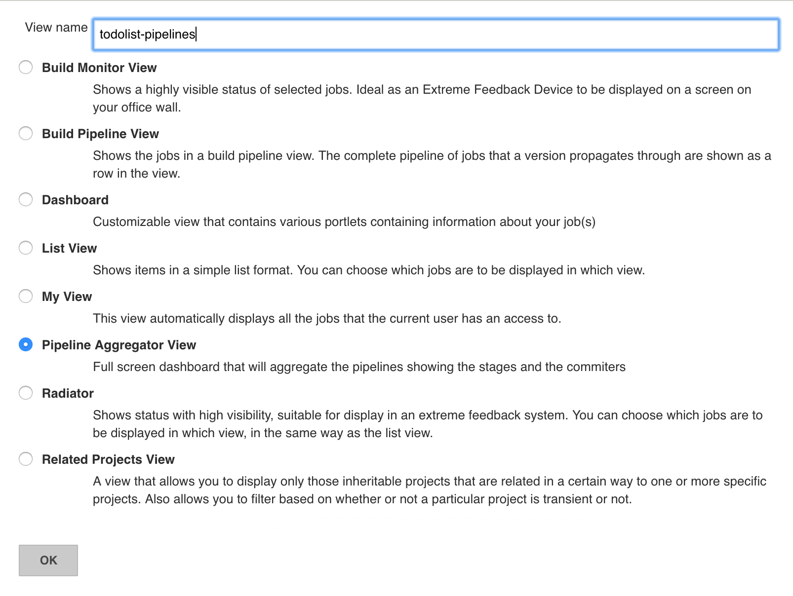
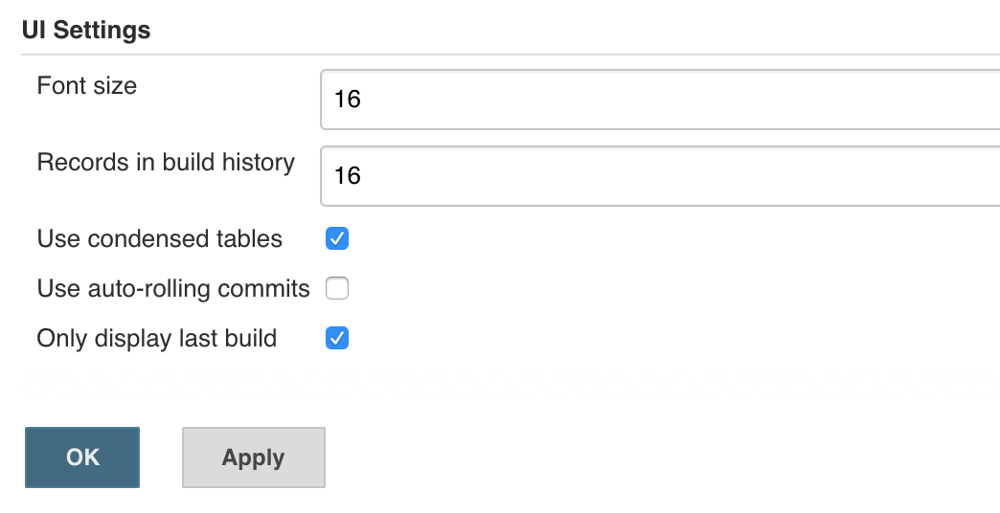
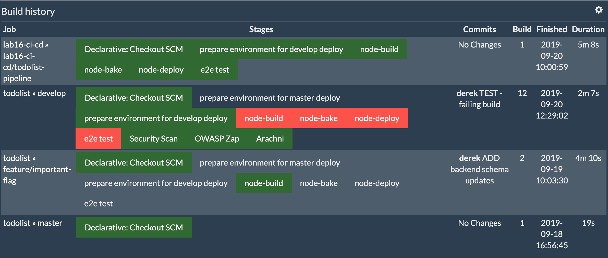
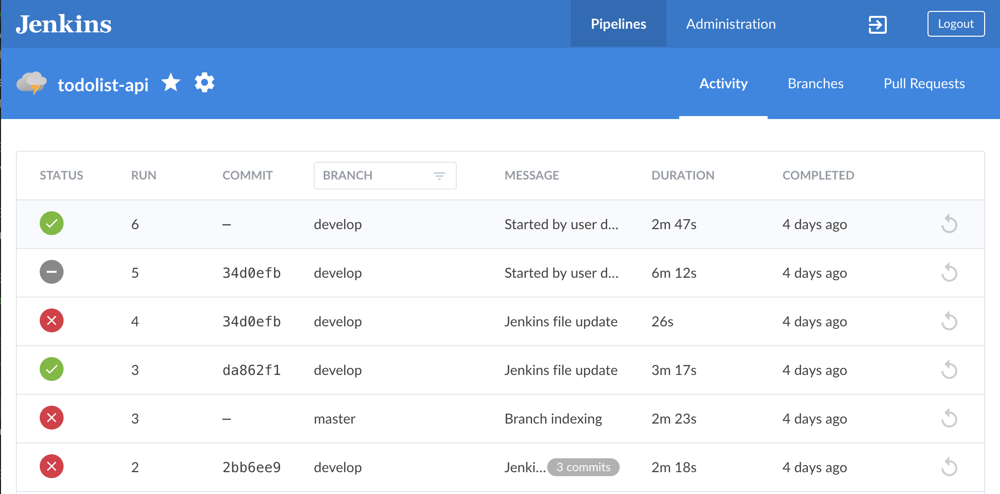
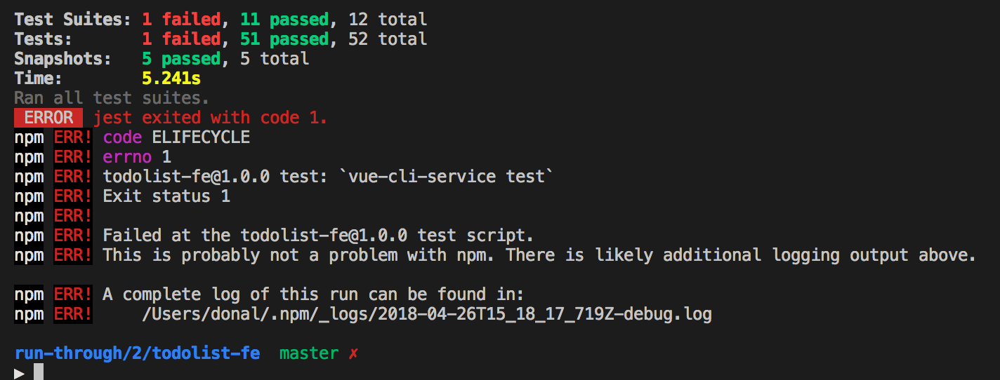

# Return of the Application Monitoring

> In this exercise we will create a build monitor to radiate vital build information and statistics
_____

## Learning Outcomes
As a learner you will be able to
- Create dashboards in Jenkins to display build status
- Seed Jenkins using DSL to create dashboards by default

## Tools and Frameworks
> Name of tool - short description and link to docs or website

1. [Build Monitor plugin](https://wiki.jenkins.io/display/JENKINS/Build+Monitor+Plugin) - Build Monitor Plugin provides a highly visible view of the status of selected Jenkins jobs. It easily accommodates different computer screen sizes and is ideal as an Extreme Feedback Device to be displayed on a screen on your office wall. (Inspired by the no longer maintained RadiatorView plugin).
1. [Build Fail Analyser](https://wiki.jenkins.io/display/JENKINS/Build+Failure+Analyzer) - This plugin analyses the causes of failed builds and presents the causes on the build page. It does this by using a knowledge base of build failure causes that is built up from scratch. Saving statistics about failure causes is also possible.
1. [Pipeline Aggregator View](https://wiki.jenkins.io/display/JENKINS/Pipeline+Aggregator+View) - Allows the users to view the history of their pipelines with stage information (failed/In Progress/Passed) and the changes monitored)

## Big Picture
This exercise begins cluster containing blah blah

_____

## 10,000 Ft View
> The goal of this exercise is to introduce Build Monitors to radiate teams progress on Dashboards.

2. Create a new Dashboard for our Builds using the plugin above. Use Regex to add jobs to it. Use the BuildFail Analyser to add meaningful data to the reason for failures.

2. Use the pipeline views in OpenShift and Jenkins to produce dashboards that teams can use. 

## Step by Step Instructions
> This is a fairly structured guide with references to exact filenames and sections of text to be added. Include pictures and code snippets where appropriate. Rule of thumb is learners are dumb.... so over describe _why_ we're doing things

### Part 1 - Create a build monitor
> _In this exercise we will create a new build monitor to show key information about our builds_

2. On Jenkins home page; create a new view by hitting the plus icon on the home screen (should be beside the `all` above the jobs list)

2. Give the job a sensible name such as `todolist-monitor` and select `Build Monitor View` 


2. On the configuration page; select `Recurse in subfolders`


2. Check the box to use Regular Expression and set the value to be something that should scrape our apps such as `.*todolist.*` 


2. Finally; select `Display committers` and set the Failure Analyser to `Description`. This allows us to write regex for when fails occur in Jenkins and have the reasons plotted on the graph. For example; number of test scores or common compilation errors. 


2. Save your configuration to see your Build Monitor! 


2. Let's create another view for Jenkins using the `Pipeline Aggregator View` plugin. This view is great because it shows lots of valuable information in a clean; easy to visualise way. Create a new view called `todolist-pipelines` and select `Pipeline Aggregator View`


2. On the configure page; set the regex to `todolist.*`


2. Set the view to `Only display last build` for simplicity of the view.


2. Save your configuration to see your Build Monitor! 


2. Explore the Jenkins Blue Ocean view for some additional monitors and views that make Jenkins look pretty!


### Part 2 - Build Fail Analyser
> _In this exercise we will intentionally fail the build to capture some metrics about why it's failed and how we can tighten the feedback for future failures_

2. Open the `todolist-fe` app in your favourite editor. In this exercise, we will fail a test and capture the message in the log and visualise it on a dashboard.

2. Open the one of the tests you wrote in previous labs; for example `tests/unit/vue-components/TodoItem.spec.js`. Negate the test at the very bottom of the file to by adding a `.not` to the `expect()` statement as shown below.
```javascript
  it("call makImportant when clicked", () => {
    const wrapper = mount(TodoItem, {
      methods,
      propsData: { todoItem: importantTodo }
    });
    // TODO - test goes here!
    const input = wrapper.find(".important-flag");
    input.trigger("click");
    expect(methods.markImportant).not.toHaveBeenCalled();
    });
});
```

2. Run your tests locally and you should see one failing test as shown below. Jenkins will have the same out put so we can capture this as code!


2. The `Test Suites: 1 failed, 11 passed, 12 total` string can be coded into a regex. On Jenkin homepage; hit the `Failure Cause Management` nav on the left hand menu. On the page that loads; hit `Create new`.

2. Call the new Failure Cause `jest-tests`. Set the Description to be `${1,1} failed out of ${1,2}`. The `${1,1}` refers to the first capture group in a regex. Click `Add indication > Build log`. Set the Pattern to match for the test output we've seen in our test execution on the terminal using this regex `.*Tests:.*(\d+) failed.*(\d+) total.*`. 


2. Our dashboards are set to show the `Description` field from the `Build Fail Analyser`. Run a build by checking in our failed tests and check the result on the Build Monitor created in previous step
```bash
$ git add .
$ git commit -m "TEST - failing build"
$ git push
```


2. We can save up these regex and inject them into the `jenkins-s2i` so the configuration is there the next time we launch and we don't have to code them up again. In `enablement-ci-cd` repo; the `jenkins-s2i/configuration/build-failure-analyzer.xml` already contains ones we've collected on previous residencies.

### Part 3 - Seed Jenkins Dashboards
> _TODO - Add instructions for creating dashboards as part of s2i in Jenkins setup using DSL_

2. Open the s2i in `enablement-ci-cd` .....

_____

## Extension Tasks
> _Ideas for go-getters. Advanced topic for doers to get on with if they finish early. These will usually not have a solution and are provided for additional scope._

Additional Alerting
 - Add `Slack` integration to the Pipeline by setting up a WebHook to call the slack endpoint with Build Stats
 - Add `Twillio` text integration to send you text messages when the build fails.
Additional Monitoring
 - Explore the Application's FEK stack inside OpenShift

## Additional Reading
> List of links or other reading that might be of use / reference for the exercise

## Slide Links

- [Intro](https://docs.google.com/presentation/d/1nfv1f04HkvN6ruOZ5JRMnHsSfDClyMNOhXxcC7WsSr4/)
- [Wrap-up](https://docs.google.com/presentation/d/1-HI9Wd5WWlzaMWmFpBEclqdyt9pFumaVbfOUrkfYKY0/)
- [All Material](https://drive.google.com/drive/folders/1Lx0OotWjisugCY11Ef0dF7EZXMIPoXOO)