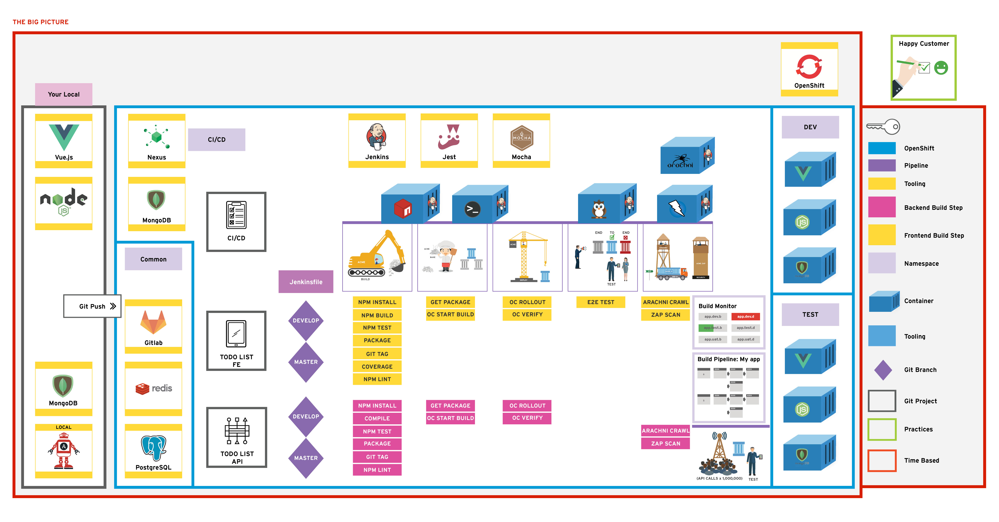

# The Cluster Awakens

> In this exercise; we will monitor the core of the OpenShift Cluster. Watch for spikes in memory usage, hard disk space and other cluster stats.

_____

## Learning Outcomes
As a learner you will be able to
- View vital stats about the clusters health using Prometheus queries
- Visualise the data on Grafana dashboards
- Overlay log messages to the Grafana dashboards creating a very short feedback loop for Ops and Dev teams.

## Tools and Frameworks
> Name of tool - short description and link to docs or website

1. [Prometheus](https://prometheus.io/) - Features Components Architecture When does it fit? When does it not fit? What is Prometheus? Prometheus is an open-source systems monitoring and alerting toolkit originally built at SoundCloud. Since its inception in 2012, many companies and organizations have adopted Prometheus, and the project has a very active developer and user community. It is now a standalone open source project and maintained independently of any company. To emphasize this, and to clarify the project's governance structure, Prometheus joined the Cloud Native Computing Foundation in 2016 as the second hosted project, after Kubernetes. For more elaborate overviews of Prometheus, see the resources linked from the media section.
1. [Grafana](https://grafana.com/) - The analytics platform for all your metrics Grafana allows you to query, visualize, alert on and understand your metrics no matter where they are stored. Create, explore, and share dashboards with your team and foster a data driven culture. Trusted and loved by the community.

## Big Picture
> From the previous exercise; we introduced app and jenkins monitoring. This exercise focuses on radiation of cluster statistics using Prometheus to scrape metrics and Grafana to display them.

_____

## 10,000 Ft View
> This should contain the goal of the exercise; with enough information that advanced learners could use this to build the exercise without much guidance. The information here

2. Create a Grafana Dashboard to show key stats of the cluster such as memory usage, remaining disk space etc.

2. Annotate the graphs by connecting the Elastic Search logs as a datasource in Grafana and running queries through it.

## Step by Step Instructions
> This is a fairly structured guide with references to exact filenames and sections of text to be added. Include pictures and code snippets where appropriate. Over describe _why_ we're doing things

_____

## Extension Tasks
> _Ideas for go-getters. Advanced topic for doers to get on with if they finish early. These will usually not have a solution and are provided for additional scope._

## Slide Links

- [Intro](https://docs.google.com/presentation/d/179Bz9GzHIcDxwb4RxxlQUESfqES4hArU1puGUjkAOoI/)
- [Wrap-up](https://docs.google.com/presentation/d/1n6f_A3i5019lZYmCBNhl9O-S3xxjpHDT5I7ZoCqYyHo/)
- [All Material](https://drive.google.com/drive/folders/13YIiKuzBmr9mGzg4bsEns5yVWx_Zc8Hs)
